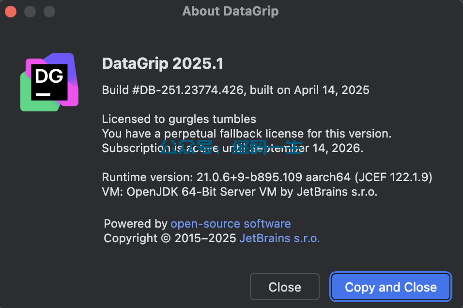

# DataGrip 2025.1 激活教程

## 第一步：解压工具包

工具[下载](https://pan.baidu.com/s/1JCZPTfXikYeeeSBjCjAZvg?pwd=4514 )后，解压 zip 破解工具包（Windows 用户打开文件的后缀名，否则提示无法找到文件）。文件解压后如下几个主要文件：


## 第二步：添加配置激活工具路径

添加激活工具路径信息，通过执行激活工具 scripts 目录下的脚本，自动添加。

激活工具下，scripts 目录中是脚本文件，进入到该目录下，可以看到多个脚本文件：


### Windows 用户

Windows 用户操作比较简单，直接双击执行 `install-current-user.vbs` 脚本文件，为当前用户激活使用工具（该操作会在 电脑环境变量 → 用户变量 下添加所有 JB 家族 IDE 的参数配置信息），如果安装有 360 安全软件会提示权限不足或者提示有风险，可以退出安全软件或者同意即可。

双击脚本之后，会弹窗提示，点击确定。如下：


点击【OK】确定，执行过程中，需要大概 10-30 秒时间（也可能需要几分钟，时间不固定）。看到提示【Done】时，继续下面的步骤。


### Mac/Linux 用户

Mac 和 Linux 用户打开电脑终端，需要在终端下切换到激活工具 scripts 路径下，执行安装脚本 `install.sh`，如下：


执行如下命令（因修改环境变量，需要输入电脑开机密码确认）：

```sh
$ sudo bash install.sh
```


出现如上图信息，表示执行完成。如果提示“Operation not permitted while System Integrity Protection is engaged”，请先赋权：

```sh
$ chmod 755 install.sh
```

再重新执行：

```sh
$ sudo bash install.sh

# 或者直接执行脚本
$ ./install.sh
```

## 第三步：重启 IDE 或电脑

保证第二步执行成功之后，需重启 IDE。Mac 和 Linux 用户需要重启电脑，才能保证工具生效。

::: danger 注意
执行完脚本工具，不要随便移动激活工具的位置，否则会造成 IDE 无法启动。如果不想用了，先执行破解的卸载脚本 `sudo bash uninstall.sh`，然后再删除工具并重启电脑即可。
:::

## 第四步：输入激活码

打开 IDE，选择【Activation Code】，添加[专属永久激活码](jets.idejihuo.com/v3/)，根据自己的 IDE 选择对应激活码。


::: details DataGrip 激活码
54H0PAD972IO7OS-eyJsaWNlbnNlSWQiOiI1NEgwUEFEOTcySU83T1MiLCJsaWNlbnNlZU5hbWUiOiJtZW5vcmFoIHBhcmFwZXQiLCJsaWNlbnNlZVR5cGUiOiJQRVJTT05BTCIsImFzc2lnbmVlTmFtZSI6IiIsImFzc2lnbmVlRW1haWwiOiIiLCJsaWNlbnNlUmVzdHJpY3Rpb24iOiIiLCJjaGVja0NvbmN1cnJlbnRVc2UiOmZhbHNlLCJwcm9kdWN0cyI6W3siY29kZSI6IlBEQiIsImZhbGxiYWNrRGF0ZSI6IjIwMjYtMDktMTQiLCJwYWlkVXBUbyI6IjIwMjYtMDktMTQiLCJleHRlbmRlZCI6dHJ1ZX0seyJjb2RlIjoiREIiLCJmYWxsYmFja0RhdGUiOiIyMDI2LTA5LTE0IiwicGFpZFVwVG8iOiIyMDI2LTA5LTE0IiwiZXh0ZW5kZWQiOmZhbHNlfSx7ImNvZGUiOiJQU0kiLCJmYWxsYmFja0RhdGUiOiIyMDI2LTA5LTE0IiwicGFpZFVwVG8iOiIyMDI2LTA5LTE0IiwiZXh0ZW5kZWQiOnRydWV9XSwibWV0YWRhdGEiOiIwMjIwMjQwNzAyUFNBWDAwMDAwNVgiLCJoYXNoIjoiMTIzNDU2NzgvMC00MTI3ODYxMTYiLCJncmFjZVBlcmlvZERheXMiOjcsImF1dG9Qcm9sb25nYXRlZCI6ZmFsc2UsImlzQXV0b1Byb2xvbmdhdGVkIjpmYWxzZSwidHJpYWwiOmZhbHNlLCJhaUFsbG93ZWQiOnRydWV9-kOcI3r7/OB1foH2R44HwHoAZJfdfTo0y7c1AZF/I9SBxiyNErjzyyFslUgkOD7XqHzhBgy53J2edgvSVy0DhmNswVK8V5YSXO+SLQc0RrQkZy43fb1fbLK26+LHj8gUUkFZuUwlDaXIb3D6SWyWx6tXAFet0ot6O7+lwZ/vGrRDXVdpaL/LBuCVt1pz2a77orzxWKbtgLNmVLVRGi7sFpUgv5syvGDgWG0gClSZHiAyEDzvoGdAJ3e8Y4LDBInHxrGwZYx7uY50lRBewjLvitbfzFm9dVz5bM9+3g+jSlXzKF5aZ9x2TyeGiOy9snk0QpnyGkudLECvI5vM8drRIIw==-MIIETDCCAjSgAwIBAgIBDTANBgkqhkiG9w0BAQsFADAYMRYwFAYDVQQDDA1KZXRQcm9maWxlIENBMB4XDTIwMTAxOTA5MDU1M1oXDTIyMTAyMTA5MDU1M1owHzEdMBsGA1UEAwwUcHJvZDJ5LWZyb20tMjAyMDEwMTkwggEiMA0GCSqGSIb3DQEBAQUAA4IBDwAwggEKAoIBAQCUlaUFc1wf+CfY9wzFWEL2euKQ5nswqb57V8QZG7d7RoR6rwYUIXseTOAFq210oMEe++LCjzKDuqwDfsyhgDNTgZBPAaC4vUU2oy+XR+Fq8nBixWIsH668HeOnRK6RRhsr0rJzRB95aZ3EAPzBuQ2qPaNGm17pAX0Rd6MPRgjp75IWwI9eA6aMEdPQEVN7uyOtM5zSsjoj79Lbu1fjShOnQZuJcsV8tqnayeFkNzv2LTOlofU/Tbx502Ro073gGjoeRzNvrynAP03pL486P3KCAyiNPhDs2z8/COMrxRlZW5mfzo0xsK0dQGNH3UoG/9RVwHG4eS8LFpMTR9oetHZBAgMBAAGjgZkwgZYwCQYDVR0TBAIwADAdBgNVHQ4EFgQUJNoRIpb1hUHAk0foMSNM9MCEAv8wSAYDVR0jBEEwP4AUo562SGdCEjZBvW3gubSgUouX8bOhHKQaMBgxFjAUBgNVBAMMDUpldFByb2ZpbGUgQ0GCCQDSbLGDsoN54TATBgNVHSUEDDAKBggrBgEFBQcDATALBgNVHQ8EBAMCBaAwDQYJKoZIhvcNAQELBQADggIBABKaDfYJk51mtYwUFK8xqhiZaYPd30TlmCmSAaGJ0eBpvkVeqA2jGYhAQRqFiAlFC63JKvWvRZO1iRuWCEfUMkdqQ9VQPXziE/BlsOIgrL6RlJfuFcEZ8TK3syIfIGQZNCxYhLLUuet2HE6LJYPQ5c0jH4kDooRpcVZ4rBxNwddpctUO2te9UU5/FjhioZQsPvd92qOTsV+8Cyl2fvNhNKD1Uu9ff5AkVIQn4JU23ozdB/R5oUlebwaTE6WZNBs+TA/qPj+5/we9NH71WRB0hqUoLI2AKKyiPw++FtN4Su1vsdDlrAzDj9ILjpjJKA1ImuVcG329/WTYIKysZ1CWK3zATg9BeCUPAV1pQy8ToXOq+RSYen6winZ2OO93eyHv2Iw5kbn1dqfBw1BuTE29V2FJKicJSu8iEOpfoafwJISXmz1wnnWL3V/0NxTulfWsXugOoLfv0ZIBP1xH9kmf22jjQ2JiHhQZP7ZDsreRrOeIQ/c4yR8IQvMLfC0WKQqrHu5ZzXTH4NO3CwGWSlTY74kE91zXB5mwWAx1jig+UXYc2w4RkVhy0//lOmVya/PEepuuTTI4+UJwC7qbVlh5zfhj8oTNUXgN0AOc+Q0/WFPl1aw5VV/VrO8FCoB15lFVlpKaQ1Yh+DVU8ke+rt9Th0BCHXe0uZOEmH0nOnH/0onD
:::


成功激活！不用在意激活的时间，已经永久激活。



[原文地址](https://blog.idejihuo.com/jetbrains/the-latest-activation-tutorial-for-datagrip-2025-1-permanent-activation-code.html)

