# CSS-FC 原理案例分析

## Box

Box 是 CSS 布局的对象和基本单位，一个页面是由很多个 Box 组成的。

::: tip 提示
显示页面所有 Box，请在控制台中输入：

```js
;[].forEach.call(document.querySelectorAll('*'), function (a) {
  a.style.outline = '1px solid red'
})
```

:::

Box 的类型由**元素的类型和 display 属性**决定。不同类型的 Box，会参与不同的 Formatting Context（一个决定如何渲染文档的容器），因此 Box 内的元素会以不同的方式渲染。

|     盒子类型     |                 属性及特性                  |          参与 FC          |
| :--------------: | :-----------------------------------------: | :-----------------------: |
| block-level box  |      `display: block/list-item/table`       | block formatting context  |
| inline-level box | `display: inline/inline-block/inline-table` | inline formatting context |

每一个 Box 都被划分为四个区域：

- Margin 外边距区
- Border 边框区
- Padding 内边距区
- Content 内容区

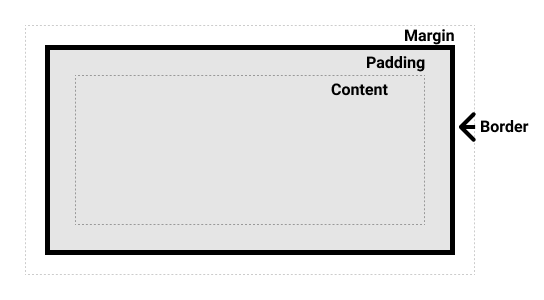

## 包含块

包含块是指一个元素**最近的祖先块元素**（inline-block、block 和 list-item 元素）的内容区，其作用是为它里面包含的元素提供一个参考。

一个元素的尺寸和位置的计算往往是由该元素梭仔的包含块决定的。

包含块可能是 Box 的 Content 包含块，也可能是 Box 的 Padding 包含块。这取决于**所包含的元素的 position 属性**：

- 如果 position 属性为 static、relative 或 stickly，包含块可能由它的最近的祖先块元素的 Content 边缘组成
- 如果 position 属性为 fixed，包含块是视口（viewport）
- 如果 position 属性为 absolute，包含块是由它最近的 position 值不是 static 的祖先元素的 Padding 边缘组成

```html
<style>
  * {
    margin: 0;
  }

  section {
    position: absolute;
    width: 400px;
    height: 160px;
    background: lightgray;
  }

  p {
    position: absolute;
    width: 50%;
    height: 25%;
    background: cyan;
  }
</style>

<body>
  <section>
    <p>This is a paragraph!</p>
  </section>
</body>
```

上面代码中，元素 p 的 position 为 absolute，所以应从内向外找到最近的 position 部位 static 的元素。这里找到了父级盒子 section，其 position 为 absolute。所以 p 的包含块为 section。

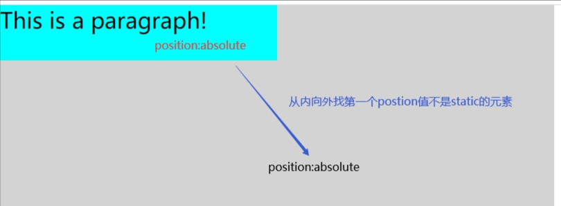

## FC

格式化上下文（Formatting Context），是页面中的一块渲染区域，并且有一套渲染规则。它决定了子元素如何定位，以及与其他元素的关系及相互作用。FC 有四种类型：

- BFC（Block Formatting Context，块级格式化上下文）
- IFC（Inline Formatting Context，行内格式化上下文）
- GFC（Grids Formatting Context，网格格式化上下文）
- FFC（Flexible Formatting Context，弹性盒格式化上下文）

其中，GFC 和 FFC 就是 CSS3 引入的新布局模型——grid 布局和 flex 布局。

## BFC

块级格式化上下文（Block Formatting Context），是用于**布局块级盒**的一块渲染区域。

### 形成条件

1. 根元素（root）
2. float：不为 none
3. position：不为 static 或 relative
4. display：inline-box/flex/inline-flex/flow-root/table-caption/table-cell
5. overflow：不为 visible（为 hidden、scroll 或 auto）

### 布局规则

1. 内部的 Box 会在**垂直方向**上，一个接一个的放置。
2. Box 垂直方向的距离由 margin 决定，**在同一个 BFC 中的两个相邻的 Box 的 margin 会发生重叠**。
3. 每个 Box 的左外边界挨着包含块的左外边界，即使存在浮动。
4. **BFC 的区域不会与 float 元素重叠**（可以制造 BFC 区域，使其与浮动元素贴边，而此时也会撑起父元素的高度）。
5. **BFC 就是页面上一个隔离的独立的容器**，容器内的子元素不会影响到外面的元素，反之亦然。
6. **计算 BFC 高度时，浮动元素也参与计算**（可以理解为，当父元素形成一个 BFC 区域时，里面的浮动元素会撑起父元素的高度）。

### 作用与原理

#### 1. 自适应两栏布局

```html
<style>
  body {
    position: relative;
  }

  .aside {
    width: 100px;
    height: 140px;
    float: left;
    background-color: gold;
  }

  .main {
    height: 200px;
    background-color: green;
  }
</style>

<body>
  <div class="aside"></div>
  <div class="main"></div>
</body>
```

根据布局规则第 3 条：**每个 Box 的左外边界挨着包含块的左外边界，即使存在浮动**，因此，即使存在浮动的 aside 元素，main 元素的左边依然会与其包含块（body）的左边相接触。

正常情况下，main 元素会与 aside 元素重叠（因为 float 导致元素 aside 脱离文档流，不再占据原来的位置，后面元素会占据前面的位置），如图：

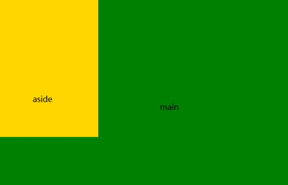

但如果我们并不想要这种效果，如何实现两栏布局呢？

根据布局规则第 4 条：**BFC 的区域不会与 float 元素重叠**，我们可以通过触发 main 元素生成 BFC 来实现：

```css
.main {
  overflow: hidden;
}
```

最终效果如下图：


#### 2. 防止 margin 重叠

```html
<style>
  .box {
    margin-left: 50%;
    overflow: hidden;
    width: 100px;
    border: 1px solid red;

    .box1,
    .box2 {
      width: 100px;
      height: 100px;
    }

    .box1 {
      margin-bottom: 30px;
    }

    .box2 {
      margin-top: 20px;
    }
  }
</style>

<body>
  <div class="box">
    <div class="box1">box1</div>
    <div class="box2">box2</div>
  </div>
</body>
```

根据布局规则第 2 条：**在同一个 BFC 中的两个相邻的 Box 的 margin 会发生重叠**，两个 box 的间距取了 `margin-bottom` 和 `margin-top` 之间的最大值 30px，发生了重叠。

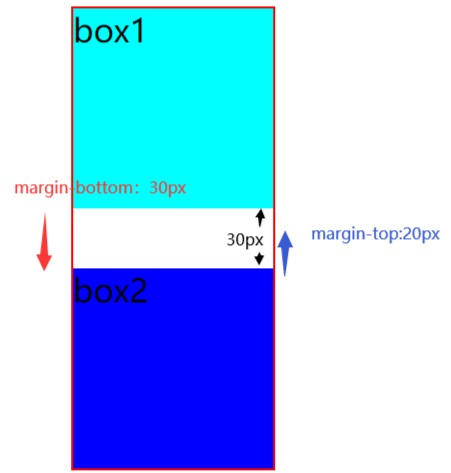

上述情况也称**边距塌陷**，我们应该如何解决塌陷的问题？

根据布局规则第 5 条：**BFC 就是页面上一个隔离的独立的容器，容器内的子元素不会影响到外面的元素**，给 box1 或者 box2 外层套一个 BFC 的盒子就可以解决：

```html
<style>
  .wrap {
    overflow: hidden;
  }
</style>

<div class="wrap">
  <div class="box1">box1</div>
</div>
```

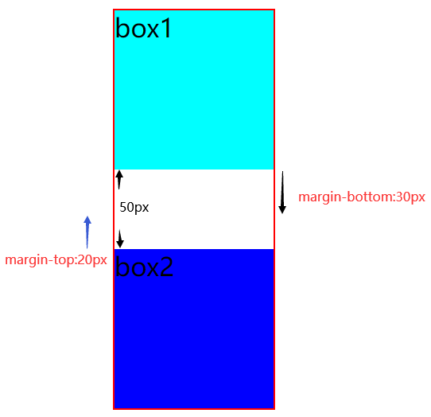

可以看到，这时两个盒子的外边距没有发生重叠，间距变为 50px。

#### 3. 清除内部浮动

清除浮动只要是为了解决：父元素因为子元素浮动引起的**内部高度为 0** 的问题

首先，页面上有一个父级盒子 father，内部放有 left 和 right 两个盒子，它们默认会撑开父盒子。同时，father 盒子下面有一个 footer 盒子。

```html
<style>
  .father {
    width: 600px;
    border: 5px solid black;

    .left {
      width: 300px;
      height: 200px;
      background-color: green;
    }

    .right {
      width: 200px;
      height: 100px;
      background-color: gold;
    }
  }

  .footer {
    width: 600px;
    height: 50px;
    background-color: hotpink;
  }
</style>

<body>
  <div class="father">
    <div class="left">left</div>
    <div class="right">right</div>
  </div>

  <div class="footer">footer</div>
</body>
```

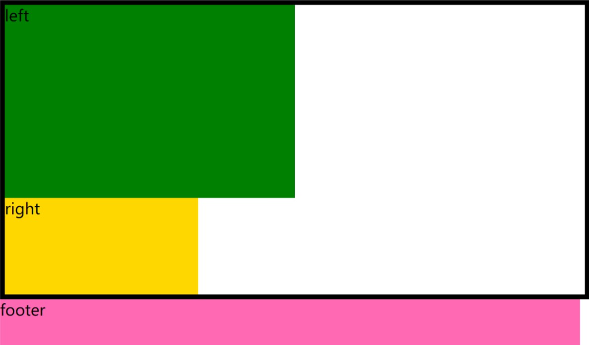

此时，给 left 和 right 两个盒子添加浮动：

```css
.left {
  float: left;
}

.right {
  float: left;
}
```

父盒子因为没有任何子盒子撑开，高度为 0，只剩下黑色边框。left 和 right 两个盒子覆盖在了 footer 盒子上面。

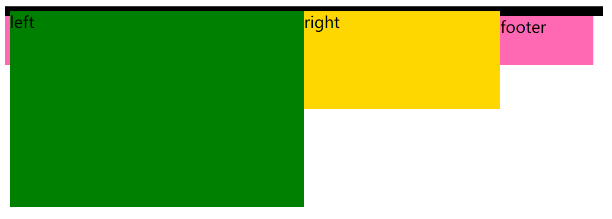

父盒子没了高度就是**高度坍塌**。要解决这个问题，可以使用 BFC 的方法清除浮动。

根据布局规则第 6 条：**计算 BFC 高度时，浮动元素也参与计算**，我们可以让父盒子触发 BFC：

```css
.fahter {
  overflow: hidden;
}
```

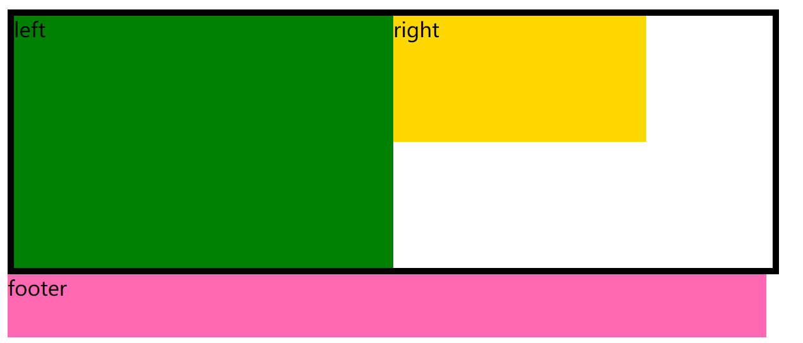

::: warning 注意
该方法的缺点是内容增多时，容易造成不会自动换行，从而导致内容被隐藏掉，无法显示要溢出的元素。

当然，清除浮动在不同的情况下使用的方法也不一样，应视具体情况而行：

- 额外标签法：添加 `clear: both;`
- 使用 after 伪元素（推荐）
- 父级元素添加 `overflow: hidden;`
- 浮动外部元素
  :::

## IFC

内联格式化上下文（Inline Formatting Context），是用于**布局内联元素**的一块渲染区域。

### 形成条件

块级元素中**仅包含**内联级别元素。

### 布局规则

1. 内联盒子是从**包含块的顶部**开始一个挨一个**水平放置**的。
2. 水平 padding、border、margin 都有效，垂直方向上不被计算。
3. 在垂直方向上，子元素会以不同形式来对齐（vertical-align）。
4. 能把在一行上的盒子都完全包含进去的一个矩形区域，被称为该行的**行盒**（Line Box）。**行盒的宽度是由包含块（Containing Box）和与其中的浮动来决定**。
5. IFC 中的 Line Box 一般左右边紧贴其包含块，但**float 元素会优先排列**。
6. IFC 中的 Line Box 高度由 CSS 行高计算规则来确定。**同一个 IFC 下的多个 Line Box 高度可能会不同**。
7. 当 inline-level boxes 的总宽度少于它们的 Line Box 时，其水平渲染规则由 `text-align` 属性值来决定。
8. 当一个 inline box 超过父元素宽度时，它会被分割成多个 boxes，这些 boxes 分布在多个 Line Box 中。如果子元素未设置强制换行的情况下，inline box 将不可被分隔，将会溢出父元素。

### 作用与原理

相比较于 BFC，IFC 的规则太杂太多，这里举几个例子就可以大概明白其特性。

#### 1. 垂直间距不生效

```html
<style>
  .wrap {
    border: 1px solid black;
    display: inline-block;
  }

  .text {
    background: red;
  }
</style>

<div class="wrap">
  <span class="text">文本一</span>
  <span class="text">文本二</span>
</div>
```

根据布局规则第 1 条可知：内联盒子是从**包含块的顶部**开始一个挨一个**水平放置**的。

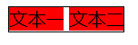

此时，给子元素加上一个四个方向的 margin：

```css
.text {
  margin: 30px;
}
```

根据布局规则第 2 条：水平 padding、border、margin 都有效，垂直方向上不被计算。可以发现，两个子元素水平两侧的间距变成了 30px，但是垂直方向上并没有任何改变。

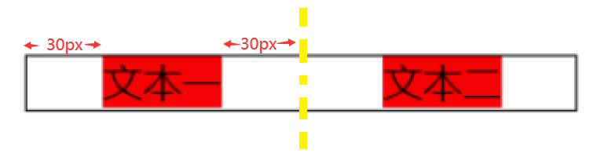

#### 2. 元素垂直居中

```html
<style></style>

<div class="father">
  
  <span>eryayayaya</span>
</div>
```

根据布局规则第 3 条可知：在垂直方向上，子元素会以不同形式来对齐（vertical-align）。默认情况下 vertical-algin 的值为 baseline，即基线对齐，行内基线位置 = 行内元素最大高度。


想要实现文字与图片垂直居中对齐，只要给图片加上 `vertical-algin: middle;` 即可。

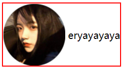

#### 3. 多个元素水平居中

```html
<style>
  .wrap {
    border: 1px solid black;
    width: 200px;
    text-align: center;
  }
  .text {
    background: red;
  }
</style>
<div class="wrap">
  <span class="text">文本一</span>
  <span class="text">文本二</span>
</div>
```

根据布局规则第 7 条可知：当 inline-level boxes 的总宽度少于它们的 Line Box 时，其水平渲染规则由 `text-align` 属性值来决定。

`<div>` 元素内部有两个 `<span>` 元素，由于 `<div>` 宽度 200px，并且内部的 `<span>` 元素总宽度小于 200px。因此，遵循 `text-align: center;`，内部元素将在 `<div>` 中水平居中对齐。

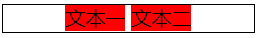

#### 4. 浮动元素优先排列

```html
<style>
  .wrap {
    width: 400px;
    border: 1px solie red;
  }
</style>

<div class="wrap">
  
  {...一段文本}
</div>
```

根据布局规则第 4 条可知：能把在一行上的盒子都完全包含进去的一个矩形区域，被称为该行的**行盒**（Line Box）。

同时，根据布局规则第 6 条可知：IFC 中的 Line Box 高度由 CSS 行高计算规则来确定。**同一个 IFC 下的多个 Line Box 高度可能会不同**。

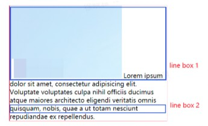

因此，可以看到第一个行盒包裹一个 img，导致第一个行盒的高度被撑开，与第二个行盒高度不同。

根据布局规则第 4 条：**行盒的宽度是由包含块（Containing Box）和与其中的浮动来决定**。给图片增加一个浮动属性 `img { float: left; }`。

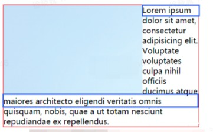

- 没有 float 元素干扰的情况下，宽度等于包含块的高度
- 有 float 元素时，减去 float 元素的宽度

所以可以看到这时行盒变了。由刚刚的高度不同变成了宽度不同。

下方的行盒因为没有浮动元素的参与，行盒的宽度 = 包含块的宽度。上方的行盒因为有浮动元素的参与，行盒的宽度 = 包含块的宽度 - 浮动元素的宽度。

## FFC

CSS3 引入了一种新的布局模型——Flex 布局，一般称为弹性盒（flexible box）模型。

Flex 布局提供了一种更加有效的方式来进行容器内的项目布局，以适应各种类型的显示设备和各种尺寸的屏幕。使用 Flex 布局实际上就是声明创建了 FFC（Flexible Formatting Context，自适应格式上下文）。

::: danger 注意
生成 FFC 后，其子元素的 float、clear 和 vertical-algin 属性将失效。
:::

### 形成条件

`display: flex/inline-flex` 的容器。

**关于弹性盒布局更详细的学习，请参见 [理解 Flexbox：你需要知道的一切](../learn-flexbox/) 一文**。

## GFC

CSS3 引入的另一种新的布局模式是 Grids 网格布局。

Flex 布局是轴线布局，只能指定“项目”针对轴线的位置。可以看作是一维布局。

Grid 布局则是**将容器还分成“行”和“列”，产生单元格**，然后指定“项目”所在的单元格，可以看作是**二维布局**。

### 形成条件

`display: grid/inline-grid` 的容器。

**关于网格局更详细的学习，请参见 [CSS Grid 布局完全指南](../css-grid02) 一文**。
