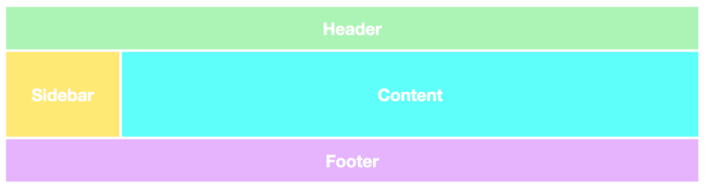
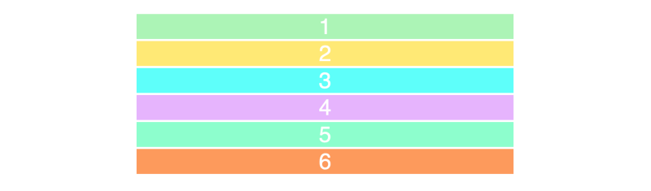
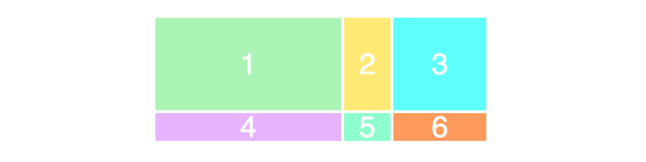
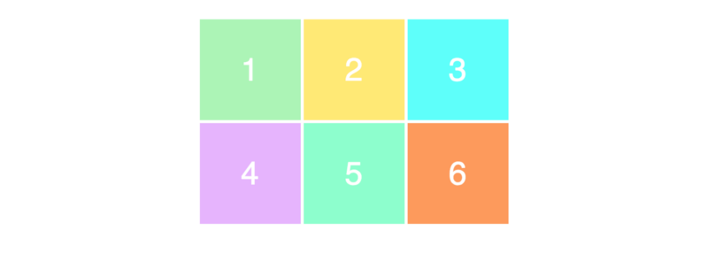
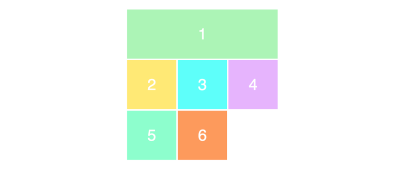
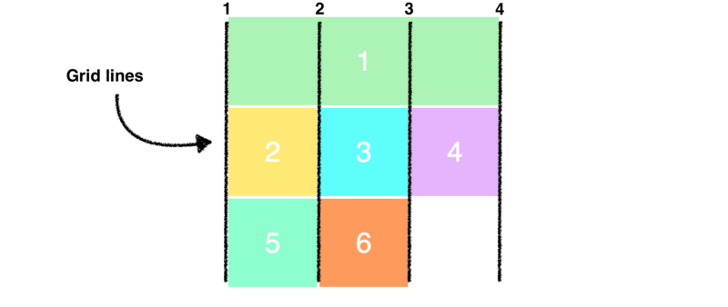
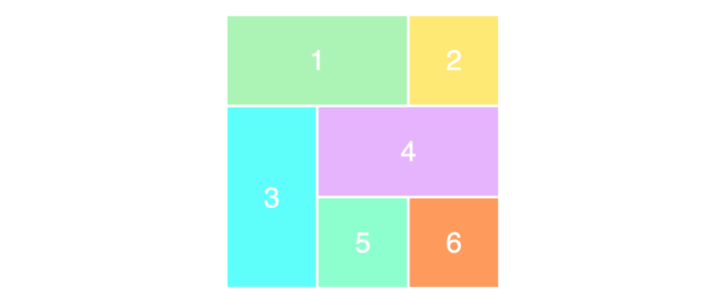

# 5 分钟学会 CSS Grid 布局



Grid 布局是网站设计的基础，CSS Grid 是创建网站布局最强大和最简单的工具。

CSS Grid 已经获得了主流浏览器（Safari、Chrome、Firefox、Edge）的原生支持，所有的前端开发人员都补习学些这项技术。

## 你的第一个 Grid 布局

CSS Grid 布局由两个核心组成部分：wrapper（父元素）和 items（子元素）。wrapper 是实际的 grid（网格），items 是 grid 内的内容。

下面是一个 wrapper 元素，内部包含 6 个 items：

```html
<div class="wrapper">
  <div>1</div>
  <div>2</div>
  <div>3</div>
  <div>4</div>
  <div>5</div>
  <div>6</div>
</div>
```

要把 wrapper 元素变成一个 grid，只要简单地把其 `display` 属性设置为 `grid` 即可：

```css
.wrapper {
  display: grid;
}
```

但是，这还没有做任何事情，因为我们还没有定义我们希望的 grid 是怎样的。它会简单地将 6 个 div 堆叠在一起。



这些 div 已经添加了一些样式，但是这与 CSS Grid 没有任何关系。

## Columns（列）和 Rows（行）

为了使其称为二维的网格容器，我们需要定义列和行。让我们创建 3 列和 2 行。我们将使用 `grid-template-rows` 和 `grid-template-columns` 属性。

```css
.wrapper {
  display: grid;
  grid-template-columns: 100px 100px 100px;
  grid-template-rows: 50px 50px;
}
```

正如你所看到的，我们为 `grid-template-columns` 写入了 3 个值，这样我们就会得到 3 列。我们想要得到 2 行，因此我们为 `grid-template-rows` 指定了 2 个值。

这些值决定了我们希望的列有多宽（100px），以及行有多高（50px）。结果如下：


为了确保你能正确理解这些值域网格外观之间的关系，请看下面这个例子：

```css
.wrapper {
  display: grid;
  grid-template-columns: 200px 50px 100px;
  grid-template-rows: 100px 30px;
}
```



非常好理解，使用起来也非常简单是不是？下面我们来加大一点难度。

## 放置 items（子元素）

接下来你需要学习的是如何在 grid（网格）上放置 items（子元素）。这里才是体现 Grid 布局超能力的地方，因为它使创建布局变得非常简单。

我们使用与之前相同的 HTML 标记，为了帮助我们更好的理解，我们为每个 item 加上了单独的 class：

```html
<div class="wrapper">
  <div class="item1">1</div>
  <div class="item2">2</div>
  <div class="item3">3</div>
  <div class="item4">4</div>
  <div class="item5">5</div>
  <div class="item6">6</div>
</div>
```

现在我们来创建一个 3 × 3 的 grid：

```css
.wrapper {
  display: grid;
  grid-template-columns: 100px 100px 100px;
  grid-template-rows: 100px 100px 100px;
}
```

将得到以下布局：



不知道你发现没有，我们只在页面上得到了 3 × 2 的 grid，而我们定义的是 3 × 3 的 grid。这是因为我们只有 6 个 item 来填满整个网格。如果我们再加 3 个 item，那么最后一行也会被填满。

要定位和调整 item 的大小，我们将使用 `grid-column` 和 `grid-row` 属性来设置：

```css
.item1 {
  grid-column-start: 1;
  grid-column-end: 4;
}
```

我们在这里做的是，希望 item1 占据从第一条网格线开始，到第四条网格线结束。换句话说，它将占据整行。以下是在屏幕上显示的内容：



如果你不明白我们设置的只有 3 列，为什么有 4 条网格线？看看下面这个图，列网格线以黑色显示：



请注意，我们现在正在使用网格中的所有行。当我们把第一个 item 占据整个第一行时，它把剩下的 items 都推到了下一行。

最后，给你一个更简单的缩写方法来编写上面的语法：

```css
.item1 {
  grid-column: 1 / 4;
}
```

为了确保你已经正确理解了这个概念，我们重新排列其他的 items：

```css
.item1 {
  grid-column-start: 1;
  grid-column-end: 3;
}

.item3 {
  grid-row-start: 2;
  grid-row-end: 4;
}

.item4 {
  grid-column-start: 2;
  grid-column-end: 4;
}
```

你可以尝试在你的脑子里过一遍上面代码的布局效果，应该不会很难。以下是效果图：


