# CSS Grid 布局完全指南

CSS Grid 布局是 CSS 中最强大的布局系统。与 Flexbox 的一维布局系统不同，CSS Grid 布局是一个二维布局系统，也就意味着它可以同时处理行和列。通过将 CSS 规则应用于父元素（Grid Container，网格容器）和其子元素（Grid Items，网格项），你就可以轻松使用 Grid 布局。

如果你刚刚接触 CSS Grid 布局，那么强烈建议你首先阅读 [5 分钟学会 CSS Grid 布局](../css-grid01)这篇文章作为你的最简入门。当你对 CSS Grid 布局有了基本的认识之后，再来阅读这篇指南。然后阅读[使用 CSS Grid 快速而又灵活的布局](../css-grid03)和[使用 CSS Grid 实现响应式布局](../css-grid04)这两篇文章，让你体会 Grid 布局真正的强大和灵活。

## 简介

CSS Grid（网格布局）又称为 Grid，是一个二维的基于网格的布局系统，它的目标是完全改变我们基于网格的用户界面的布局方式。

CSS 一直用来布局我们的页面，但一直以来都存在这样或那样的问题。一开始我们用表格（table），然后是浮动（float），再是定位（position）和内嵌块（inline-block）。但是，所有这些方法本质上都只是 hack 而已，并且遗漏了很多重要的功能（例如垂直居中）。Flexbox 的出现很大程度上改善了我们的布局方式，但它的目的是为了解决更简单的一维布局，而不是复杂的二维布局。Grid 布局是第一个专门为解决布局问题而创建的 CSS 模块，我们终于不需要相近办法 hack 页面布局样式了。

实际上 Flexbox 和 Grid 能结合在一起工作，而且配合得非常好。

## 基础知识和浏览器支持

首先，你必须使用 `display: grid;` 将元素定义为一个 grid 布局，使用 `grid-template-columns` 和 `grid-template-rows` 属性设置列和行的尺寸大小，然后通过 `grid-column` 和 `grid-row` 属性将其子元素放入这个 grid 中。与 Flexbox 类似，网格项（grid items）的源顺序无关紧要。你的 CSS 可以按任何顺序放置它们，然后完全重新排列布局以适应不同的屏幕宽度，这些都只需要几行 CSS 代码，想象一下就让人兴奋！Grid 布局是有史以来最强大的 CSS 模块之一。

到目前为止，许多浏览器都提供了对 CSS Grid 的原生支持，而且无需加浏览器前缀。这个浏览器支持数据来自 [Caniuse](https://caniuse.com/css-grid)。

## 重要术语

在深入了解 Grid 的概念之前，理解术语是很重要的。由于这里涉及的术语在概念上都很相似，如果不先记住 Grid 规范定义的含义，很容易混淆它们。但是别担心，术语并不多。

### 网格容器（Grid Container）

应用 `display: grid;` 的元素。这是所有网格项（Grid Items）的直接父元素。在下面例子中，container 就是网格容器。

```html
<div class="container">
  <div></div>
  <div></div>
  <div></div>
</div>
```

### 网格项（Grid Items）

网格容器的直接子元素。下面例子中的 item 元素就是网格项，但是 sub-item 不是。

```html
<div class="container">
  <div class="item"></div>
  <div class="item"></div>
  <div class="item">
    <p class="sub-item"></p>
  </div>
  <div class="item"></div>
</div>
```

### 网格项（Grid Line）

构成网格结构的分界线。它们既可以是垂直的（列网格线，column grid lines），也可以是水平的（行网格线，row grid lines），并位于行或列的任一侧。例如，下图中的黄线就是一条网格线。


### 网格轨道（Grid Track）

两条相邻网格线之间的空间。你可以把它们想象成网格的列或行。下图是第 2 条和第 3 条网格线之间的网格轨道。

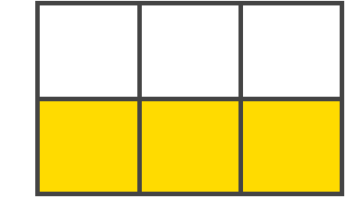

### 网格单元格（Grid Cell）

两条相邻的行和两条相邻的列网格线之间的空隙。这是 Grid 系统的一个“单元”。下图是第 1 至第 2 条行网格线，和第 2 至第 3 条列网格线交汇构成的网格单元格。


### 网格区域（Grid Area）

四条网格线包围的总空间。一个网格区域可以由任意数量的网格单元格组成。下图是行网格线 1 和 3，以及列网格线 1 和 3 之间的网格区域。

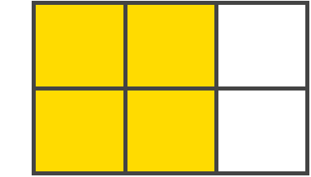

## 网格容器属性

### display

将元素定义为网格容器，并为其内容建立新的网格格式上下文。

- grid：生成一个块级网格
- inline-grid：生成一个内联网格
- subgrid：如果你的网格容器本身是另一个网格的网格项（即嵌套网格），你可以使用该值来表示（它的行/列的大小继承自它的父级网格容器，而不是自己指定的）

```css
.container {
  display: grid;
}
```

::: danger 注意
在网格容器上使用 column、float、clear、vertical-align 不会产生任何效果。
:::

### grid-template-columns/rows

使用空格分隔的值列表，用来定义网格的列和行。这些值表示网格轨道大小，它们之间的空格表示网格线。

- track-size：可以使用长度值、百分比或者网格容器中可用空间（使用 fr 单位）
- line-name：你可以选择的任意名称

```css
.container {
  grid-template-columns: 40px 50px auto 50px 40px;
  grid-template-rows: 25% 100px auto;
}
```

当你在网格轨道之间留出空格时，网格线会自动分配数字名称。

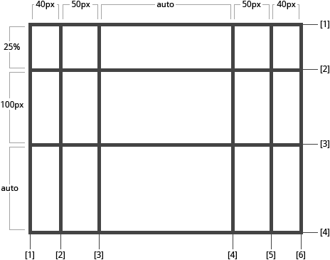

你也可以明确的指定网格线名称，即 line-name 值。**请注意网格线名称的括号语法**。

```css
.container {
  grid-template-columns: [first] 40px [line2] 50px [line3] auto [col4-start] 50px [five] 40px [end];
  grid-template-rows: [row1-start] 25% [row1-end]100px [third-line] auto [last-line];
}
```

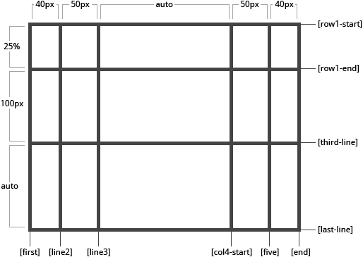

一条网格线可以有多个名称。例如，这里的第 2 条行网格线将有两个名字：row1-end 和 row2-start。

```css
.container {
  grid-template-rows: [row1-start] 25% [row1-end row2-start] 25% [row2-end];
}
```

如果你的定义包含多个重复值，则可以使用 `repeat()` 函数来简化定义：

```css
.container {
  grid-template-columns: repeat(3, 20px [col-start]) 5%;
}
```

上面的代码等价于：

```css
.container {
  grid-template-columns: 20px [col-start] 20px [col-start] 20px [col-start] 5%;
}
```

fr 单位允许你用等分网格容器剩余可用空间来设置网格轨道的大小。例如，下面的代码会将每个网格项设置为网格容器宽度的三分之一：

```css
.container {
  grid-template-columns: 1fr 1fr 1fr;
}
```

剩余可用空间时除去所有非灵活网格项之后计算得到的。在这个例子中，可用空间总量减去 50px 后，再给 fr 单元的值 3 等分：

```css
.container {
  grid-template-columns: 1fr 50px 1fr 1fr;
}
```

### grid-template-areas

通过引用 `grid-area` 属性指定的网格区域来定义网格模板。重复网格区域的名称导致内容跨越这些单元格。一个点号代表一个空的网格单元。这个语法本身可视作网格的可视化结构。

- grid-area-name：由网格项的 `grid-area` 指定的网格区域名称
- 点号（.）：代表一个空的网格单元
- none：不定义网格区域

```css
.item-a {
  grid-area: header;
}

.item-b {
  grid-area: main;
}

.item-c {
  grid-area: sidebar;
}

.item-d {
  grid-area: footer;
}

.container {
  grid-template-columns: 50px 50px 50px 50px;
  grid-template-rows: auto;
  grid-template-area:
    'header header header header'
    'main main . sidebar'
    'footer footer footer footer';
}
```

上面的代码将创建一个 4 列 3 行的网格。整个顶行由 header 区域组成。中间一排由两个 main 区域，一个空单元格，和一个 sidebar 区域组成。最后一行全是 footer 区域组成。

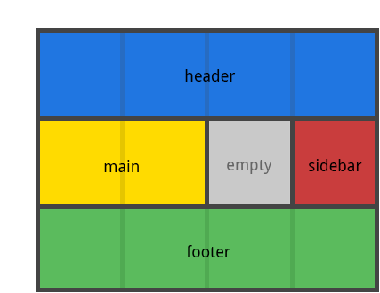

声明中的每一行都需要有相同数量的单元格。你可以使用任意数量的相邻的点来声明单个空单元格。只要这些点之间没有间隙隔开，它们就表示一个单一的单元格。

::: tip 提示
你不是用这个语法来命名网格线，只是命名网格区域。当你使用这种语法时，区域两端的网格线实际上是自动命名的。如果你的网格区域的名字是 foo，该区域的起始行网格线和列网格线的名称将是 foo-start，而最后一行的行网格线可能有多个名字，如上例中最左边的网格线，它将有三个名称：header-start、main-start 和 footer-start。
:::

### grid-template

用于定义 `grid-template-rows`、`grid-template-columns` 和 `grid-template-areas` 的缩写属性。

- none：将所有三个属性设置为其初始值
- subgrid：将 `grid-template-rows` 和 `grid-template-columns` 的值设为 subgrid，`grid-template-areas` 设为初始值
- \<grid-template-rows\>/\<grid-template-columns\>：将 `grid-template-rows` 和 `grid-template-columns` 设置为相应的特定的值，并将 `grid-template-areas` 设为 none

这个属性也接受一个更复杂但相当方便的语法来指定三个上述属性。这里有一个例子：

```css
.container {
  grid-template:
    [row1-start] 'header header header' 25px [row1-end]
    [row2-start] 'footer footer footer' 25px [row2-end] / auto 50px auto;
}
```

等价于：

```css
.container {
  grid-template-rows: [row1-start] 25px [row1-end row2-start] 25px [row2-end];
  grid-template-columns: auto 50px auto;
  grid-template-areas:
    'header header header'
    'footer footer footer';
}
```

::: warning 提示
由于 `grid-template` 不会重置隐式网格属性（`grid-auto-columns`、`grid-auto-rows` 和 `grid-auto-flow`），这可能是你想在大多数情况下做的，建议使用 `grid` 属性而不是 `grid-template`。
:::

### grid-row/column-gap

指定网格线的大小。你可以把它想想为设置列/行之间间距的宽度。

- line-size：长度值

```css
.container {
  grid-template-columns: 100px 50px 100px;
  grid-template-row: 80px auto 80px;
  grid-row-gap: 15px;
  grid-column-gap: 10px;
}
```

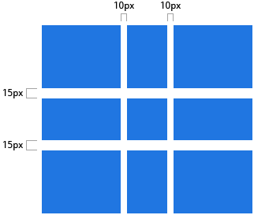

::: warning 注意
只能在列/行之间创建间距，网格外部边缘不会有这个间距。
:::

`grid-gap` 属性是 `grid-row-gap` 和 `grid-column-gap` 的缩写语法。上面代码可以写成：

```css
.container {
  grid-gap: 15px 10px;
}
```

如果 `grid-gap` 省略了第二个值，浏览器认为第二个值等于第一个值。

::: tip 提示
根据最新标准，`grid-` 前缀已经删除，写成 `row-gap`、`column-gap` 和 `gap` 即可。
:::

### justify-items

沿着行轴线（Row Axis）对齐网格项内的内容（相反的属性是 `align-items` 沿着列轴线对齐）。该值适用于容器内的所有网格项。

- start：将内容对齐到网格区域的左侧
- end：将内容对齐到网格区域的右侧
- center：将内容对齐到网格区域的中间（水平居中）
- stretch：填满网格区域宽度（默认值）

```css
.container {
  justify-items: start;
}
```

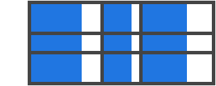

```css
.container {
  justify-items: end;
}
```

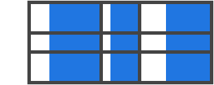

```css
.container {
  justify-items: center;
}
```

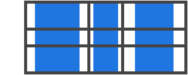

```css
.container {
  justify-items: stretch;
}
```

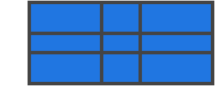

这些行为也可以通过单独网格项的 `justify-self` 属性设置。

### align-items

沿着列轴线（Column Axis）对齐网格项内的内容（相反的属性是 `justify-items`）。该值适用于容器内的所有网格项。

- start：将内容对齐到网格区域的顶部
- end：将内容对齐到网格区域的底部
- center：将内容对齐到网格区域的中间（垂直居中）
- stretch：填满网格区域高度（默认值）

```css
.container {
  align-items: start;
}
```


```css
.container {
  align-items: end;
}
```

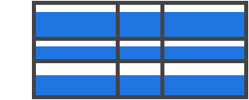

```css
.container {
  align-items: center;
}
```

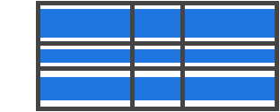

```css
.container {
  align-items: stretch;
}
```


这些行为也可以通过单独网格项的 `align-self` 属性设置。

### place-items

该属性是 `align-items` 和 `justify-items` 的合并简写形式。

```css
.container {
  place-items: start end;
}
```

如果省略第二个值，则浏览器认为与第一个值相等。

### justify-content

有时，你的网格合计大小可能小于网格容器大小。如果你的所有网格项都使用像 px 这样的非灵活单位，在这种情况下，你可以设置网格容器内的网格的对齐方式。此属性沿着行轴线对齐网格。

- start：将网格对齐到网格容器的左边
- end：将网格对齐到网格容器的右边
- center：将网格对齐到网格容器的中间（水平居中）
- stretch：调整网格项的宽度，允许该网格填充整个网格容器的宽度
- space-around：在每个网格项之间放置一个均匀的空间，左右两端放置一半的空间
- space-between：在每个网格项之间放置一个均匀的空间，左右两端没有空间
- space-evenly：在每个网格项之间及左右两端都放置一个均匀的空间

```css
.container {
  justify-content: start;
}
```

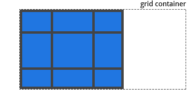

```css
.container {
  justify-content: end;
}
```

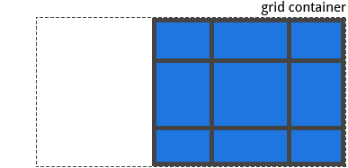

```css
.container {
  justify-content: center;
}
```

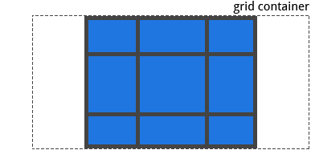

```css
.container {
  justify-content: stretch;
}
```

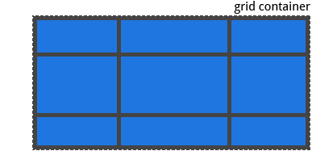

```css
.container {
  justify-content: space-around;
}
```

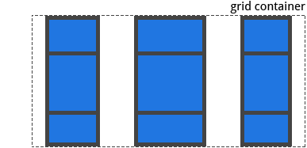

```css
.container {
  justify-content: space-between;
}
```

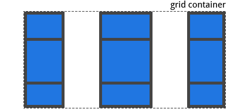

```css
.container {
  justify-content: space-evenly;
}
```

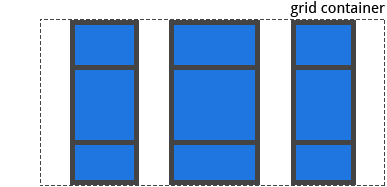

### align-content

该属性与 `justify-content` 相反，沿着列轴线对齐网格。

- start：将网格对齐到网格容器的顶部
- end：将网格对齐到网格容器的底部
- center：将网格对齐到网格容器的中间（垂直居中）
- stretch：调整网格项的高度，允许该网格填充整个网格容器的高度
- space-around：在每个网格项之间放置一个均匀的空间，上下两端放置一半的空间
- space-between：在每个网格项之间放置一个均匀的空间，上下两端没有空间
- space-evenly：在每个网格项之间及上下两端都放置一个均匀的空间

```css
.container {
  align-content: start;
}
```

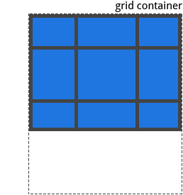

```css
.container {
  align-content: end;
}
```

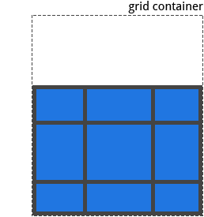

```css
.container {
  align-content: center;
}
```

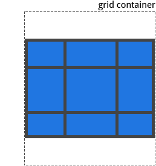

```css
.container {
  align-content: stretch;
}
```

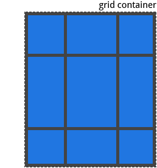

```css
.container {
  align-content: space-around;
}
```

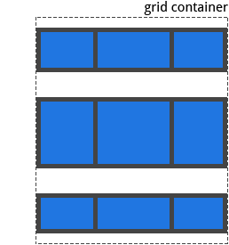

```css
.container {
  align-content: space-between;
}
```

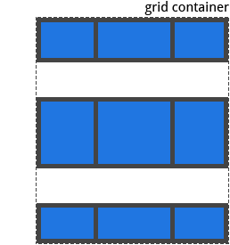

```css
.container {
  align-content: space-evenly;
}
```

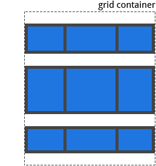

### place-content

该属性是 `align-content` 和 `justify-content` 的合并简写形式。

```css
.container {
  place-content: space-around space-evenly;
}
```

如果省略第二个值，则浏览器认为与第一个值相等。

### grid-auto-columns/rows

指定任何自动生成的网格轨道（又称隐式网格轨道）的大小。在你明确定位的行或列（通过 `grid-template-rows/columns`），超出定义的网格范围时，隐式网格轨道被创建了。

- track-size：可以是长度值、百分比或者等分网格容器中可用空间（使用 fr 单位）

为了说明如何创建隐式网格轨道，请看下面代码：

```css
.container {
  grid-template-columns: 60px 60px;
  grid-template-row: 90px 90px;
}
```

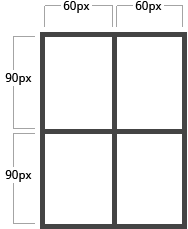

生成了一个 2 × 2 的网格。

但现在想象一下，你使用 `grid-column` 和 `grid-row` 来定位你的网格项，像这样：

```css
.item-a {
  grid-column: 1/2;
  grid-row: 2/3;
}

.item-b {
  grid-column: 5/6;
  grid-row: 2/3;
}
```

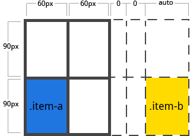

我们告诉 .item-b 从第 5 条列网格线开始到第 6 条列网格线结束，但我们从来没有定义过第 5 或者第 6 列网格线。

因为我们引用的网格线不存在，所以创建宽度为 0 的隐式网格轨道来填补空缺。我们可以使用 `grid-auto-columns/rows` 来指定这些隐式轨道的大小。

```css
.container {
  grid-auto-columns: 60px;
}
```

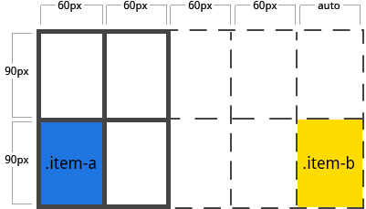

### grid-auto-flow

如果你有一些没有明确放置在网格上的网格项，自动放置算法会自动放置这些网格项。该属性控制自动布局算法如何工作。

- row：依次填充每行，根据需要添加新行（默认值）
- column：依次填充每列，根据需要添加新列
- dense：发告诉自动布局算法在稍后出现较小的网格项时，尝试填充网格中较早的空缺

dense 极可能导致你的网格项出现乱序。考虑以下 HTML：

```html
<section class="container">
  <div class="item-a">item-a</div>
  <div class="item-b">item-b</div>
  <div class="item-c">item-c</div>
  <div class="item-d">item-d</div>
  <div class="item-e">item-e</div>
</section>
```

你定义一个有 5 列和 2 行的网格，并将 `grid-auto-flow` 设置为 row：

```css
.container {
  display: grid;
  grid-template-columns: repeat(5, 60px);
  grid-template-rows: repeat(2, 30px);
  grid-auto-flow: row;
}
```

将网格项放在网格上时，只能为其中的两个指定位置：

```css
.item-a {
  grid-column: 1;
  grid-row: 1/3;
}

.item-e {
  grid-column: 5;
  grid-row: 1/3;
}
```

因为我们把 `grid-auto-flow` 设置成了 row，所以我们的网格看起来回事这样。注意，我们没有进行定位的网格项 item-b、item-c 和 item-d 会这样排列在可用的行中。

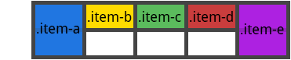

而如果我们把 `grid-auto-flow` 设置成 column，没有进行定位的网格项会沿着列向下排列。

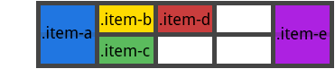

### grid

在一个声明中设置所有以下属性的缩写：`grid-template-rows/columns/areas`、`grid-auto-rows/columns/flow`。

它还将 `grid-column/row-gap` 设置为初始值，即使它们不可以通过 `grid` 属性显示设置。

- none：将所有子属性设置为初始值
- \<grid-template-rows\>/\<grid-template-columns\>：分别设置为指定值，将所有其他子属性设置为初始值
- \<grid-auto-flow\>[\<grid-auto-rows\>[/\<grid-auto-columns\>]]：分别接受所有值。如果省略了 `grid-auto-columns`，它将设置为 `grid-auto-rows` 指定的值。如果两者都被省略，它们就会被设置为初始值。

以下两个代码块是等效的：

```css
.container {
  grid: 200px auto / 1fr auto 1fr;
}
```

```css
.container {
  grid-template-rows: 200px auto;
  grid-template-columns: 1fr auto 1fr;
  grid-template-areas: none;
}
```

以下两个代码块也是等效的：

```css
.container {
  grid: column 1fr / auto;
}
```

```css
.container {
  grid-auto-flow: column;
  grid-auto-rows: 1fr;
  grid-auto-columns: auto;
}
```

它也接受一个更复杂但相当方便的语法来一次设置所有内容。

```css
.container {
  grid:
    [row1-start] 'header header header' 1fr [row1-end]
    [row2-start] 'footer footer footer' 25px [row2-end] / auto 50px auto;
}
```

等价于：

```css
.container {
  grid-template-areas:
    'header header header'
    'footer footer footer';
  grid-template-rows: [row1-start] 1fr [row1-end row2-start] 25px [row2-end];
  grid-template-columns: auto 50px auto;
}
```

## 网格项属性

### grid-column/row-start/end

通过指定网格线来确定网格内网格项的位置。start 是网格项开始的网格线，end 是网格项结束的网格线。

- line：可以是一个数字引用一个编号的网格线，或者一个名字来引用是一个命名的网格线
- span(number)：该网格项将跨越所提供的网格轨道数量
- span(name)：该网格项将跨越到它与提供的名称位置
- auto：表示自动放置，自动跨度，默认会扩展一个网格轨道的宽度或高度

```css
.item-a {
  grid-column-start: 2;
  grid-column-end: five;
  grid-row-start: row1-start;
  grid-row-end: 3;
}
```

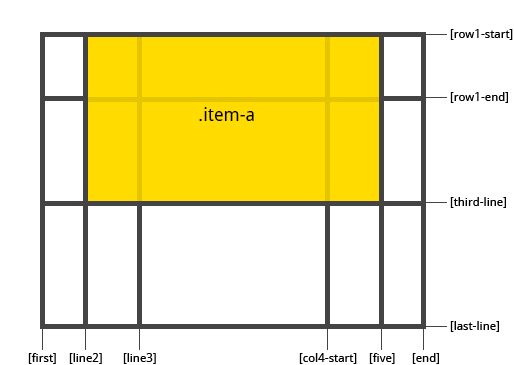

```css
.item-b {
  grid-column-start: 1;
  grid-column-end: span col4-start;
  grid-row-start: 2;
  grid-row-end: span 2;
}
```

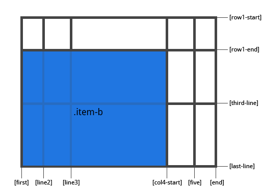

如果没有声明指定 `grid-column/row-end`，默认情况下，该网格项占据一个轨道。

::: tip 提示
网格项可以相互重叠，你可以使用 `z-index` 来控制它们的重叠顺序。
:::

### grid-column/row

分别为 `<grid-column-start>/<grid-column-end>` 和 `<grid-row-start>/<grid-row-end>` 的缩写形式。

```css
.item-c {
  grid-column: 3 / span 2;
  grid-row: third-line / 4;
}
```

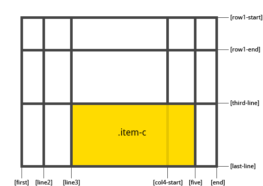

如果没有声明分割线结束为止，则该网格项默认占据一个网格轨道。

### grid-area

为网格项提供一个名称，以便可以使用网格容器 `grid-template-areas` 属性创建的模版进行引用。

另外，这个属性可以用作 `grid-row/column-start/end` 的缩写。

作为网格项分配名称的一种写法：

```css
.item-d {
  grid-area: header;
}
```

作为属性的缩写形式：

```css
.item-d {
  grid-area: 1 / col4-start / last-line / 6;
}
```

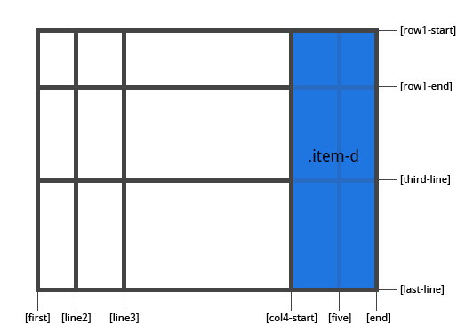

### justify-self

沿着行轴线对齐网格项的内容。适用于单个网格项内的内容。

- start：将内容对齐到网格区域的左侧
- end：将内容对齐到网格区域的右侧
- center：将内容对齐到网格区域的中间（水平居中）
- stretch：填满网格区域宽度（默认值）

```css
.item-a {
  justify-self: start;
}
```

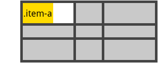

```css
.item-a {
  justify-self: end;
}
```

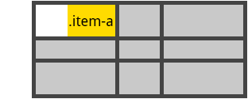

```css
.item-a {
  justify-self: center;
}
```

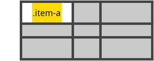

```css
.item-a {
  justify-self: stretch;
}
```

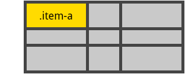

### align-self

沿着列轴线对齐网格项的内容。适用于单个网格项内的内容。

- start：将内容对齐到网格区域的顶部
- end：将内容对齐到网格区域的底部
- center：将内容对齐到网格区域的中间（垂直居中）
- stretch：填满网格区域高度（默认值）

```css
.item-a {
  align-self: start;
}
```

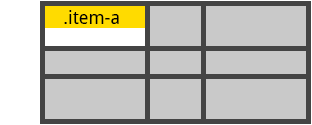

```css
.item-a {
  align-self: end;
}
```

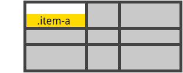

```css
.item-a {
  align-self: center;
}
```

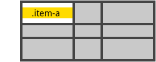

```css
.item-a {
  align-self: stretch;
}
```


### place-self

该属性是 `align-self` 和 `justify-self` 的合并简写形式。

```css
.item-a {
  place-self: center;
}
```

如果省略第二个值，则浏览器认为与第一个值相等。
