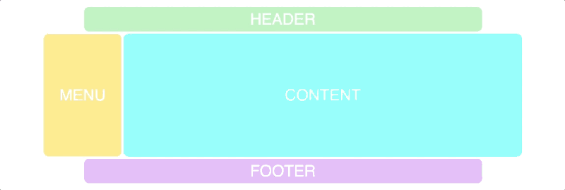
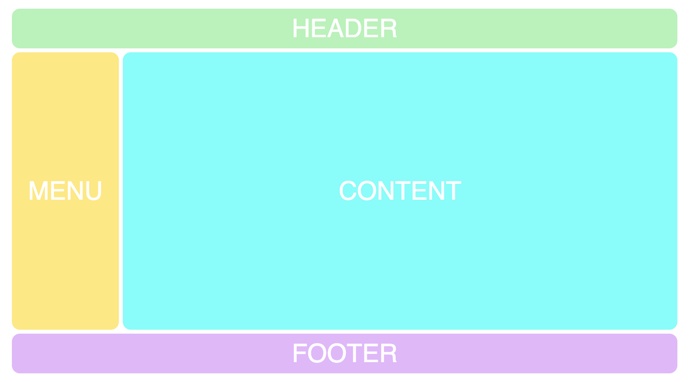
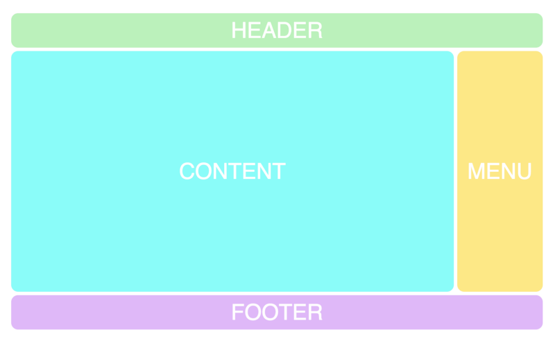
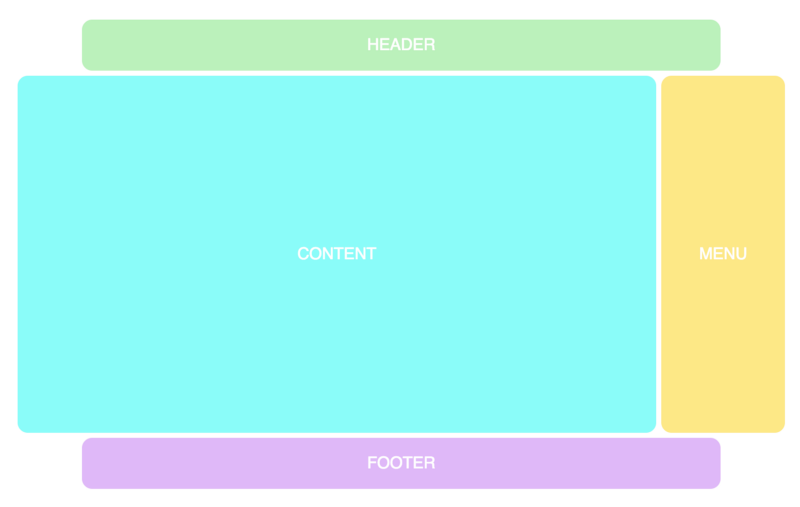
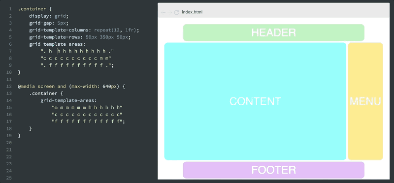

# 使用 CSS Grid 快速而又灵活的布局

CSS Grid（网格）模块是创建网站布局一个非常棒的工具。它能是你快速地进行布局，比你尝试过的任何其他布局系统都快。本文会教你如何使用它进行快速布局。

## 需要创建的网格

我们将模仿一个经典网站布局，从非常基本的 Grid 开始：



首先，将解释我们需要的 HTML 和 CSS，分为四个部分。一旦你了解了这些，我们将继续进行布局试验。

如果你对 CSS Grid 比较陌生，则可能需要浏览一下 [5 分钟学会 CSS Grid 布局](../css-grid01)这篇文章。当然，如果你想完全掌握 CSS Grid 布局，那么请看 [CSS Grid 布局完全指南](../css-grid02)，特别是文章中的网格术语的解释，可以帮你加快理解本文。本文讨论更多的是 Grid 布局的实际应用以及灵活性。

### HTML 结构

我们需要的第一件事是一点 HTML。一个网格容器（container）和网格项（header、menu、content 和 footer）。

```html
<div class="container">
  <div class="header">HEADER</div>
  <div class="menu">MENU</div>
  <div class="content">CONTENT</div>
  <div class="footer">FOOTER</div>
</div>
```

### 设置基本的 CSS

我们需要把 container 元素设置 `display: grid;`，将其设置为网格容器，并指定我们需要多少行和列。这是基本的 CSS：

```css
.container {
  display: grid;
  grid-gap: 5px;
  grid-template-columns: repeat(12, 1fr);
  grid-template-rows: 50px 350px 50px;
  grid-template-areas:
    'h h h h h h h h h h h h'
    'm m c c c c c c c c c c'
    'f f f f f f f f f f f f';
}
```

`grid-template-areas` 属性背后的逻辑是你在代码中创建的网格可视化标识。正如你所看到的，它有 3 行 12 列，和我们在上面定义的正好呼应。

每行代码一行，使用网格术语来说就是网格轨道，每个字符（h，m，c，f）代表一个网格单元格。其实是网格区域名称，你可以使用任意名称。

四个字母中的每一个现在都形成一个矩形 `grid-area`。

### 给网格项设定网格区域名称

现在我们需要将这些字符与网格中的网格项建立对应的连接。要做到这一点，我们将在网格项使用 `grid-area` 属性：

```css
.header {
  grid-area: h;
}

.menu {
  grid-area: m;
}

.content {
  grid-area: c;
}

.footer {
  grid-area: f;
}
```

以下是完整的布局效果：



### 尝试其他布局

现在我们开始讨论 Grid 布局特性的精妙之处，因为我们可以很容易地对布局进行修改尝试。

只需修改 `grid-template-areas` 属性的字符即可。举个例子，把 menu 移到右边：

```css
.container {
  grid-template-areas:
    'h h h h h h h h h h h h'
    'c c c c c c c c c c m m'
    'f f f f f f f f f f f f';
}
```

修改后的布局效果：



我们可以使用点号 `.` 来创建空白的网格单元格：

```css
.container {
  grid-template-areas:
    '. h h h h h h h h h h .'
    'c c c c c c c c c c m m'
    '. f f f f f f f f f f .';
}
```

修改后的布局效果看起来是这样：



## 添加响应式布局

将 Grid 布局与响应式布局结合起来，简直就是一个杀手锏。因为在 Grid 布局之前，仅使用 HTML 和 CSS 实现的响应式布局不可能做到简单而又完美。假设你在移动设备上查看的是标题旁边是菜单，那么你可以简单地这样做：

```css
@media screen and (max-width: 640px) {
  .container {
    grid-template-areas:
      'm m m m m m h h h h h h'
      'c c c c c c c c c c c c'
      'f f f f f f f f f f f f';
  }
}
```

你将看到以下效果：



## 总结

请记住，所有这些更改都是使用纯 CSS 完成的，不需要修改 HTML。无论 div 标签在 HTML 中是怎样的顺序结构，我们都可以随意转化。这点与 Flexbox 类似，网格项的源顺序无关紧要，你的 CSS 可以以任何顺序放置它们，这使得使用媒体查询重新排列网格变得非常容易。

这被称为结构和表现分离，Grid 布局真正做到了这一点。对于 CSS 来说是一个巨大的进步。它允许 HTML 变成你要想的样子。HTML 结构不再受限于样式表现，比如不要为了实现某种布局而多次嵌套，现在这些都可以让 CSS 来完成。
