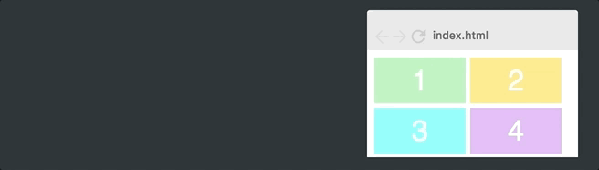

# 使用 CSS Grid 实现响应式布局


在这篇文章中，我将教你如何使用 CSS Grid（网格）布局来创建一个超酷的图像网格，它会根据屏幕的宽度改变列的数量，以实现响应式布局。

本文中最漂亮的一部分是，添加一行 CSS 代码即可实现响应式布局。这意味着我们不必通过丑陋的类名（如 col-sm-4，col-md-8）来混淆 HTML，或者为每一个屏幕尺寸创建媒体查询。

现在就让我们开始吧！

## 设置

对于本文，我们将继续使用 [5 分钟学会 CSS Grid 布局](../css-grid01)这篇文章中使用的网格。然后我们将在文章的最后添加图片，以下是我们的初始网格外观：


这是 HTML：

```html
<div class="container">
  <div>1</div>
  <div>2</div>
  <div>3</div>
  <div>4</div>
  <div>5</div>
  <div>6</div>
</div>
```

还有相应的 CSS：

```css
.container {
  display: grid;
  grid-template-columns: 100px 100px 100px;
  grid-template-rows: 50px 50px;
}
```

这里也有一些基本的样式，比如容器宽度、网格间隙、背景颜色等，我不会在这里介绍，因为它与 CSS Grid 没有任何关系。

如果这段代码让你感到困惑，我建议你阅读 [5 分钟学会 CSS Grid 布局](../css-grid01)这篇文章，在那里我解释了 Grid 布局模块的基础知识。

让我们开始将列事项响应式布局。

## 使用等分 fr 单位实现基本的响应式

CSS Grid 带来了一个全新的值，称为等分单位，即 fr。它允许你将任意可用空间分成你想要的多个等分空间。让我们将每个列改为一个等分单位宽度。

```css
.container {
  display: grid;
  grid-template-columns: 1fr 1fr 1fr;
  grid-template-rows: 50px 50px;
}
```

这里发生的事情是，将整个网格的宽度分为三等分，每一列都占据一个 fr 单位。结果是：


如果我们将 `grid-template-columns` 的值改为 `1fr 2fr 1fr`，那么第 2 列现在将是另外 2 列的 2 倍。总宽度现在是 4 等分，第 2 列占据了 2 等分，其他 2 列则各占 1 等分。看起来类似这样：


换句话说，等分单位值使你可以非常容易地改变列的宽度。

## 更加高级的响应式

但是，上面的例子并没有给我们想要的响应式，因为这个网格总是包含 3 列。我们希望我们的网格根据容器的宽度来改变列的数量。要做到这一点，你必须学习三个新的概念。

### repeat()

我们将从 `repeat()` 函数开始，这是指定列和行最强大的方法。让我们把原来的网格改成使用 `repeat()`。

```css
.container {
  display: grid;
  grid-template-columns: repeat(3, 100px);
  grid-template-rows: repeat(2, 50px);
}
```

实际上 `repeat(3, 100px)` 与 `100px 100px 100px` 相同。第一个参数指定了你想要的列数或行数，第二个参数指定了它们的宽度或高度。所以上面的代码将为我们创建和第一个一样的布局。


### auto-fit

`auto-fit` 是自适应。让我们跳过固定数量的列，而是用 `auto-fit` 取代 3。

```css
.container {
  display: grid;
  grid-template-columns: repeat(auto-fit, 100px);
  grid-template-rows: repeat(2, 50px);
}
```

这会达到以下效果：



你会看到，现在这个网格已经可以通过容器的宽度来改变列的数量了。但是，它知识试图尽可能多地将 100px 宽的列排列在容器中。如果我们将所有列硬编码为 100px，我们永远得不到想要的灵活性，因为它们很少会加起来正好等于容器的宽度。正如你在上面 gif 图中看到的，网格通常会在右侧留下空白区域。

### minmax()

为了解决这个问题，我们需要的最后一种方法是 `minmax()`。我们只需要 `minmax(100px, 1fr)` 替换 100px 即可。这是最终的 CSS。

```css
.container {
  display: grid;
  grid-template-columns: repeat(auto-fit, minmax(100px, 1fr));
  grid-template-rows: repeat(2, 50px);
}
```

所有的响应都发生在这一行 CSS 中。这会达到以下效果：


正如你所见，这样很完美。`minmax()` 函数定义大于等于 min 且小于等于 max 的大小范围。所以，现在列的宽度至少 100px。但是，如果有更多可用空间时，网格将简单地分配给每个列，因为列的值变成了一个等分单位 1fr，而不是 100px。

## 添加图片

最后一步是添加图片。这与 CSS Grid 没有任何关系，但是我们还是要来看看代码。我们将在每个网格项内加一个 `` 标签。

```html
<div></div>
```

为了使图像适合该网格项，我们将它设置为网格项一样宽和高，然后使用 `object-fit: cover;`。这样将使图片覆盖整个容器，如果需要的话，浏览器会裁剪该图片。

```css
.container > div > img {
  width: 100%;
  height: 100%;
  object-fit: cover;
}
```

效果如下：


就是这么简单！你已经了解了 CSS Grid 中最复杂的概念之一，所以后面请自己动手吧。
