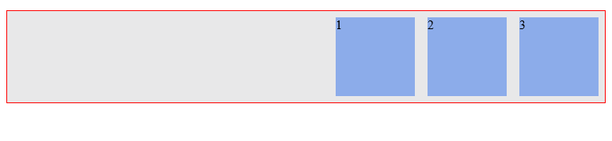
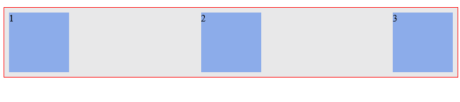
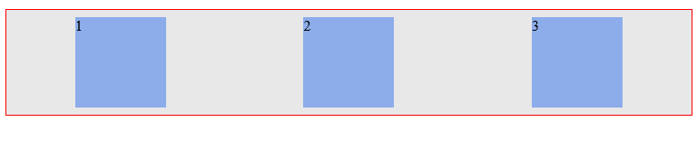
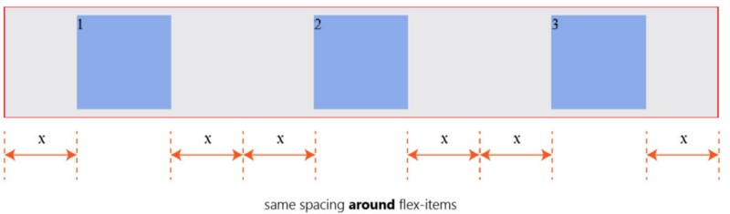
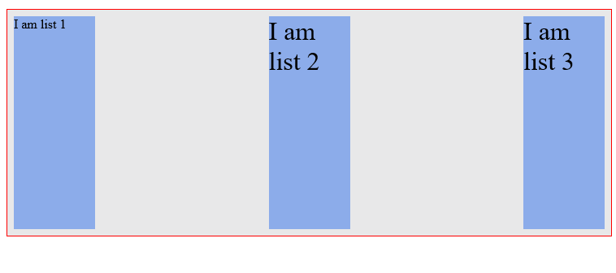
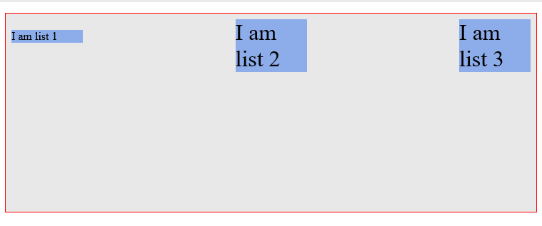
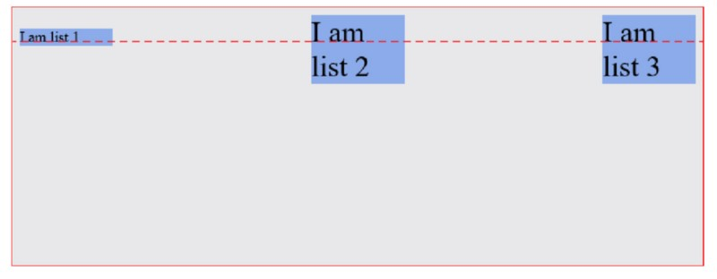
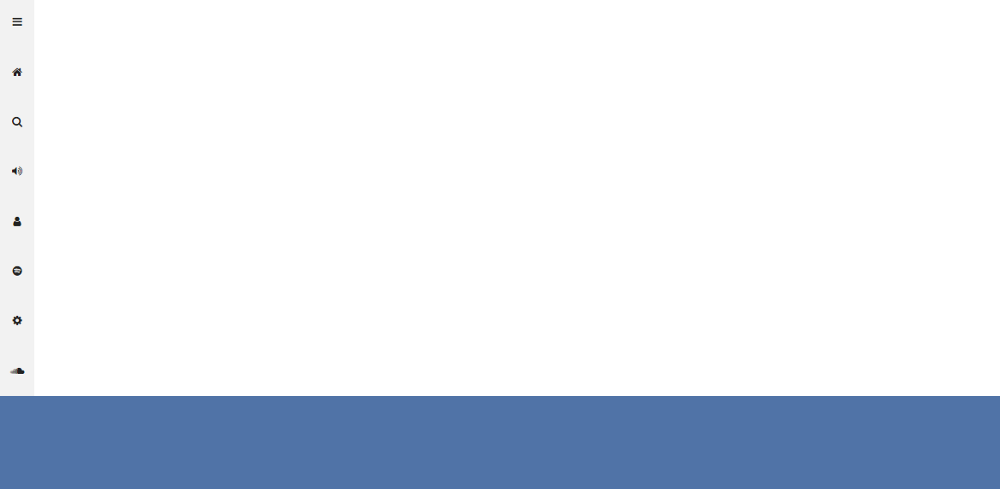
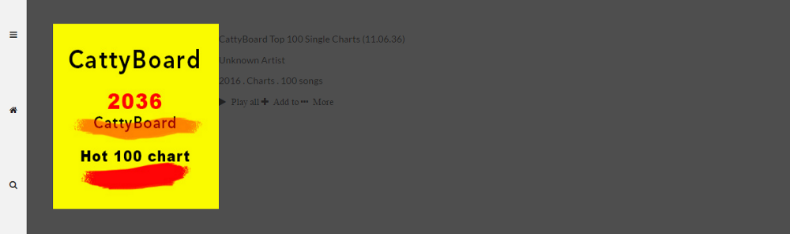
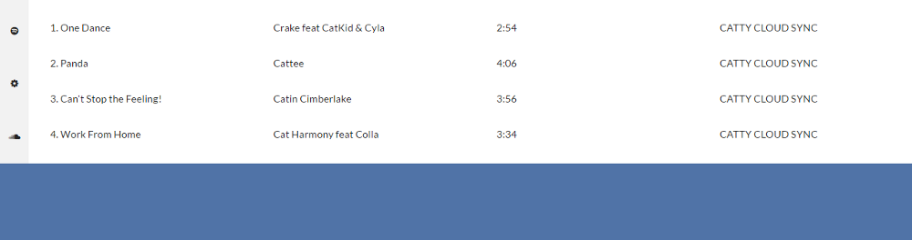

# 理解 Flexbox：你需要知道的一切

## 概述

学习 Flexbox 可不是件有趣的事情，因为它将挑战你所知道的 CSS 布局方面的知识。当然，这也是非常正常的，因为一切知识都是值得学习的。

另外，你要认真对待 Flexbox。因为它是现代 Web 布局的主流方式之一，不会很快就消失。它已成为一个 W3C 标准规范。

首先，我将带你先了解 Flexbox 的一些基础知识。我想这是开始尝试学习 Flexbox 的必经阶段。

学习基础知识是件有意思的事情，更有意思的是，可以通过学习这些基础理论知识，在实际的应用程序中去使用。

然后，我们会使用 Flexbox 来做一个音乐应用程序的布局（UI 界面布局）。


在开始进入学习 Flexbox 构建音乐应用程序的布局之前，你还将需要了解 Flexbox 在响应式 Web 设计中所起的作用。同时，我将陪你一起做一些练习。这看起来可能很无聊，但这是让你彻底掌握 Flexbox 必经的过程，只有这样才能让你擅长使用 Flexbox。

## 基础篇

### 简介

CSS 在过去的几年里已经发生了很大的变化。在 CSS 中引入了设计师喜欢的 filters、transitions 和 transforms 等。但有些东西已经消失了，可是我们都渴望这些东西能一直存在。

使用 CSS 制作智能的、灵活的页面布局，一直以来都是 CSSer 想要的，也有很多人使用各种不同的 CSS 黑魔法去实现智能的页面布局。

我们总是不得不忍受 `float`、`display: table` 这些布局方式带来的痛苦。如果你写过一段时间的 CSS，你可能有相关体会。如果你没有写过 CSS，那你是幸运的，在这也欢迎你来到了 CSS 布局中一个更美好的世界！

现在我们可以抛弃 CSS 布局的黑魔法，是时候去拥抱一个更简洁的制作智能布局的现代语法了。

### Flexbox 是什么

根据规范中的描述可知道，Flexbox 模块提供了一个有效的布局方式，即使不知道视窗大小或者未知元素的情况之下都可以智能的、灵活的调整和分配元素和空间两者之间的关系。简单的理解，就是可以自动调整、计算元素在容器空间中的大小。

### 如何开始使用 Flexbox

这是每个人都会问的第一个问题，答案比你预想的要简单得多。开始使用 Flexbox 时，你所要做的第一件事就是声明一个 Flex 容器（Flex Container）。比如一个简单的项目列表，我们常常看到的 HTML 形式如下所示：

```html
<ul>
  <!--parent element-->
  <li></li>
  <!--first child element-->
  <li></li>
  <!--second child element-->
  <li></li>
  <!--third child element-->
</ul>
```

一眼就能看出来，这就是一个无序列表（`<ul>`）里有三个列表元素（`<li>`）。你可以把 `<ul>` 称为父元素，`<li>` 称为子元素。

要开始使用 Flexbox，必须先让父元素变成一个 Flex 容器。你可以在父元素的 `display` 属性设置为 `flex` 或者 `inline-flex`。就这么简单，这样你就可以开始使用 Flexbox 模块了。

```css
/* 声明父元素为 flex 容器 */
ul {
  display: flex; /* 或者 inline-flex */
}
```

给 `<li>` 添加一点基本样式，你能看到发生了什么。

```css
li {
  width: 100px;
  height: 100px;
  background-color: #8cacea;
  margin: 8px;
  list-style: none;
}
```

你将看到的效果如下图所示：


你可能没有注意到，但事实上已经发生了变化。现在已经是一个 Flexbox 格式化上下文。记住，默认情况下 `<div>` 在 CSS 中是垂直堆栈的，也就是说从上到下排列显示，就像下图这样：


然而，简单的写一行代码 `display: flex;`，你立即就可以看到布局改变了。现在列表元素（`<li>`）从左到右水平排列，就像是你使用了 `float` 一样。

Flexbox 模块的开始，正如前面的介绍，在任何元素上使用 `display: flex;`。你可能不明白为什么这一变化就能改变列表元素的排列方式。但我可以负责任的告诉你，你深入学习之后就能明白。现在你只需要信任就足够了。

还有一件事情，我需要提醒你注意：一旦你设置了 `display` 属性的值为 `flex`，`<ul>` 就会自动变成 **Flex 容器**，而其子元素 `<li>` 就变成了 **Flex 项目**。

这些术语会一次又一次的提到，我更希望你通过一些更有趣的东西来帮助你学习 Flexbox 模块。我使用了两个关键词，我们把重点放到它们身上。了解它们对于理解后面的知识至关重要：

- Flex 容器（Flex Container）：父元素设置了 `display: flex;`
- Flex 项目（Flex Items）：Flex 容器内的子元素

### Flex 容器属性

通过上面的内容，我们知道了如何启动 Flexbox 模块，以及 Flex 容器和 Flex 项目是什么。现在是一个好好利用它们的时机了。

设置一个父元素作为 Flex 容器后，有几个对齐属性可以使用在 Flex 容器上。正如你对块元素的 `width` 属性设置了 200px 的值，有六种不同的属性可以用于 Flex 容器。好消息是，定义这些属性不同于你以往使用过的任何一种方法。

#### flex-direction

`flex-direction` 属性控制 Flex 项目沿着主轴的排列方向。它具有四个值：

`row | column | row-reverse | column-reverse`

简单点来说，就是 `flex-direction` 属性让你决定 Flex 项目如何排列。它可以是行（水平）、列（垂直），或者行和列的反向。

从技术上讲，水平和垂直在 Flex 世界种不是什么方向（概念）。它们常常被称为主轴（Main-Axis）和侧轴（Cross-Axis）。默认设置如下所示：


Main-Axis 默认方向为水平，即从左到右；Cross-Axis 默认方向为垂直，即从上到下。

`flex-direction` 属性的默认值是 `row`。它让 Flex 项目沿着 Main-Axis 排列（从左向右，水平排列）。这就解释了本文开始部分时无序列表的表现效果。


如果把 `flex-direction` 属性的值修改成 `column`，这时 Flex 项目将沿着 Cross-Axis 从上到下垂直排列，而不再是从左向右。


#### flex-wrap

`flex-wrap` 具有三个属性值：

`wrap | nowrap | wrap-reverse`

我将通过一个例子来解释如何使用 `flex-wrap` 属性。

首先在前面的无序列表的 HTML 结构种添加几个列表项。将 Flex 容器设置合适大小以放置更多的列表项目或者说让列表项目换行排列。这两种方式，你是怎么想的？

```html
<ul>
  <!--parent element-->
  <li></li>
  <!--first child element-->
  <li></li>
  <!--second child element-->
  <li></li>
  <!--third child element-->
  <li></li>
  <li></li>
  <li></li>
</ul>
```

幸运的是，新添加的 Flex 项目刚好适合 Flex 容器大小。也就是 Flex 项目刚好填充 Flex 容器。


再深入一点，继续给 Flex 容器内添加 Flex 项目，比如说添加 10 个 Flex 项目。这个时候会发生生么？


同样的，Flex 容器还是能容纳所有子元素（Flex 项目）排列。这是每一个 Flex 容器的默认行为，Flex 容器会在一行内容纳所有的 Flex 项目。这是因为 `flex-wrap` 属性的默认值是 `nowrap`。也就是说，Flex 项目在 Flex 容器内部换行排列。

```css
ul {
  flex-wrap: nowrap; /* Flex 容器内的 Flex 项目部换行排列 */
}
```

当你希望 Flex 容器内的 Flex 项目达到一定数量时，能换行排列，可以把 `flex-wrap` 属性的值设置为 `wrap`：

```css
ul {
  flex-wrap: wrap;
}
```

现在 Flex 项目在 Flex 容器中就会多行排列。在这种情况下，当一行不能包含所有列表项时，它们就会多行排列。


除此之外，还有一个值 `wrap-reverse`，它也可以让 Flex 项目在容器中多行排列，只是方向相反。


#### flex-flow

`flex-flow` 是 `flex-direction` 和 `flex-wrap` 两个属性的速记属性。比如下面的实例：

```css
ul {
  flex-flow: row wrap;
}
```

相当于：

```css
ul {
  flex-direction: row;
  flex-wrap: wrap;
}
```

除了这个组合之外，你还可以尝试一些其他的组合：`flex-flow: row nowrap;`、`flex-flow: column wrap;`、`flex-flow: column nowrap;` 等。

#### justify-content

`justify-content` 属性可以接受下面五个值之一：

`flex-start | flex-end | center | space-between | space-around`

`justify-content` 属性主要定义了 Flex 项目在 Main-Axis 上的对齐方式。来看一个简单的例子，还是考虑下面这简单的无序列表：

```html
<ul>
  <li>1</li>
  <li>2</li>
  <li>3</li>
</ul>
```

添加一些基本样式：

```css
ul {
  display: flex;

  border: 2px solid red;
  padding: 0;
  list-style: none;
  background-color: #e8e8e9;
}

li {
  width: 100px;
  height: 100px;
  background-color: #8cacea;
  margin: 8px;
  padding: 4px;
}
```

你看到的效果是这样：


通过 `justify-content` 属性，可以让 Flex 项目在整个 Main-Axis 上按照自己所希望的那样来设置对齐方式。

- flex-start

  `justify-content` 的默认属性值是 `flex-start`。它让所有 Flex 项目靠 Main-Axis 开始边缘（左对齐）。也就是上图看到的效果。

  ```css
  ul {
    justify-content: flex-start;
  }
  ```

- flex-end

  `flex-end` 让所有 Flex 项目靠 Main-Axis 结束边缘（右对齐）。

  ```css
  ul {
    justify-content: flex-end;
  }
  ```

  

- center

  `center` 让所有 Flex 项目排在 Main-Axis 中间（居中对齐）。

  ```css
  ul {
    justify-content: center;
  }
  ```

  

- space-between

  `space-between` 让除了第一个和最后一个 Flex 项目的两者间间距相同（两端对齐）。

  ```css
  ul {
    justify-content: space-between;
  }
  ```

  

  你注意到有什么不同？看看下图的描述：

  

- space-around

  `space-around` 让每个 Flex 项目具有相同的空间。

  ```css
  ul {
    justify-content: space-around;
  }
  ```

  

  和 `space-between` 有点不同，第一个 Flex 项目和最后一个 Flex 项目距 Main-Axis 开始边缘和结束边缘的间距是其他相邻 Flex 项目间距的一半。

  

千万不要觉得这些练习太多，这些练习可以帮助你熟悉 Flexbox 属性的语法，也能更好的帮助你理解它们是如何影响 Flex 项目沿着 Main-Axis 的对齐方式。

#### align-items

`align-items` 属性类似于 `justify-content` 属性。只有理解了 `justify-content` 属性，才能更好的理解这个属性。`align-items` 属性可以接受下面五个值之一：

`flex-start | flex-end | center | stretch | baseline`

它主要用来控制 Flex 项目在 Cross-Axis 上的对齐方式。这也是 `align-items` 和 `justify-content` 两个属性之间的不同之处。下面是不同的值对 Flex 项目产生的影响。不要忘记这个属性只对 Cross-Axis 有影响。

- stretch

  `align-items` 的默认值是 `stretch`。让所有的 Flex 项目高度和 Flex 容器高度一样。

  我们修改一下之前的 CSS 代码来看看效果。去掉 `<li>` 标签的 `height` 声明，在 `<ul>` 标签中增加 `height: 300px;`，将代码改成如下所示：

  ```css
  ul {
    display: flex;
    border: 2px solid red;
    padding: 0;
    list-style: none;
    background-color: #e8e8e9;
    height: 300px;
  }

  li {
    width: 100px;
    background-color: #8cacea;
    margin: 8px;
    padding: 4px;
  }
  ```

  下图为显示的效果：

  

- flex-start

  正如你所希望的。`flex-start` 让所有 Flex 项目靠 Cross-Axis 开始边缘（顶部对齐）。

  

- flex-end

  `flex-end` 让所有 Flex 项目靠 Cross-Axis 结束边缘（底部对齐）。

  

- center

  `center` 让 Flex 项目在 Cross-Axis 中间（居中对齐）。

  

- baseline

  `baseline` 让所有 Flex 项目在 Cross-Axis 上沿着它们自己的基线对齐。

  

  结果看上去有点像 `flex-start`，但略有不同。下图应该能帮助你更好的理解。

  

#### align-content

还记得前面讨论的 `wrap` 属性吗？我们在 Flex 容器中添加了更多的 Flex 项目，让 Flex 容器中的 Flex 项目多行排列。

`align-content` 属性用于多行的 Flex 容器。它也是用来控制 Flex 项目在 Flex 容器里的排列方式，排列效果和 `align-items` 值一样，但除了 `baseline` 属性值。

像 `align-items` 属性一样，它的默认值是 `stretch`。你现在应该熟悉这些值。那它又是如何影响 Flex 容器里的 10 个 Flex 项目多行排列方式的呢？

- stretch

  使用 `stretch` 会拉伸 Flex 项目，让它们沿着 Cross-Axis 适应 Flex 容器可用的空间。

  

  你看到的 Flex 项目间的间距，是 Flex 项目自身设置的 `margin` 值。

- flex-start

  之前你看到过 `flex-start`。这次是让多行 Flex 项目靠 Cross-Axis 开始边缘，沿着 Cross-Axis 从上到下排列。因此，Flex 项目在 Flex 容器中顶部对齐。

  

- flex-end

  `flex-end` 和 `flex-start` 相反，让多行 Flex 项目靠着 Cross-Axis 结束位置，让 Flex 项目沿着 Cross-Axis 从下到上排列，即底部对齐。

  

- center

  `center` 让多行 Flex 项目在 Cross-Axis 中间，在 Flex 容器中居中对齐。

  

这是 Flex 容器的最后一个属性。你现在知道如何使用各种 Flex 容器属性，你可以在工作中实践这些属性。

### Flex 项目属性

现在，我们把注意力从 Flex 容器转移到 Flex 项目及其对齐属性。像 Flex 容器，对齐属性也可以用在所有的 Flex 项目。

#### order

允许 Flex 项目在一个 Flex 容器中重新排列。基本上，你可以改变 Flex 项目的顺序，从一个位置移动到另一个位置。这不会影响代码，这也意味着 Flex 项目的位置在 HTML 源码中不需要改变。

`order` 属性的默认值是 0，它可以接受一个正值，也可以接受一个负值。值得注意的是，Flex 项目会根据 `order` 值重新排序，从低到高。要说明总得需要一个例子，考虑下面这个无序列表：

```html
<ul>
  <li>1</li>
  <li>2</li>
  <li>3</li>
  <li>4</li>
</ul>
```

默认情况下，所有 Flex 项目的 `order` 值都是 0。把前面给列表的样式运用过来，看到的效果如下：


Flex 项目显示是按 HTML 源码的顺序来的。如果因为某些原因，在不改变 HTML 文档源码情况之下，想把 Flex 项目 1 从 1 变成最后。不能修改 HTML 源码的意思是你不能把 HTML 代码改成：

```html
<ul>
  <li>2</li>
  <li>3</li>
  <li>4</li>
  <li>1</li>
</ul>
```

这个时候就需要 `order` 属性，你需要把 项目 1 的 `order` 属性设置得比其他 Flex 项目值更大。如果你以前使用过 `z-index` 属性，那你就能更好的理解这个属性。

```css
li:nth-child(1) {
  order: 1; /* 设置一个比 0 更大的值 */
}
```

Flex 项目就重新进行了排序，从低到高排列。不要忘记了，默认情况喜爱，Flex 项目 2、3、4 的 `order` 值为 0.现在 Flex 项目 1 的 `order` 值为 1。


如果给 Flex 项目 2 的 `order` 值设置为 2 呢？它也增加堆栈。现在代表 Flex 项目的最高 `order` 值。


当两个 Flex 项目具有相同的 `order` 值呢？在下面的示例中，把 Flex 项目 1 和 3 设置相同的 `order` 值：

```css
li:nth-child(1) {
  order: 1;
}

li:nth-child(3) {
  order: 1;
}
```


现在仍是从低到高排列。这次 Flex 项目 3 排在 Flex 项目 1 后面，那是因为 HTML 文档中 Flex 项目 3 出现在 Flex 项目 1 后面。

如果两个以上 Flex 项目有相同的 `order` 值时，Flex 项目重新排序是基于 HTML 源码的位置进行排序的。

#### flex-grow 和 flex-shrink

Flex 项目最优秀的一点就是灵活性。`flex-grow` 和 `flex-shrink` 属性控制 Flex 项目有多余的空间时如何放大（扩展），在没有额外空间时又如何缩小。

它们能接受 0 或者大于 0 的任何正数。接下来阐述它们的使用。使用一个简单的无序列表作为例子，它只包含一个列表项：

```html
<ul>
  <li>I am a simple list</li>
</ul>
```

添加更多的样式，看起来像这样：


默认情况下，`flex-grow` 属性值为 0。表示 Flex 项目不会增长，填充 Flex 容器可用空间。取值为 0 就是一个开和关的按钮，表示 `flex-grow` 开关是关闭的。

如果把 `flex-grow` 的值设置为 1，会变成：


现在项目扩展了，占据了 Flex 容器所有可用空间，也就是说开关打开了。如果你试着调整浏览器的大小，Flex 项目也会缩小，以适应新的屏幕宽度。

为什么？默认情况下，`flex-shrink` 的值是 1，也就是说 `flex-shrink` 开关也是打开的。可以仔细看看 `flex-grow` 和 `flex-shrink` 属性在各种情况下的效果，这样能更好的帮助你理解。

#### flex-basis

`flex-basis` 属性可以指定 Flex 项目的初始大小。`flex-basis` 默认的值是 auto，也可以取任何用于 `width` 属性的值，比如 %、cm、rem、px 等。

如果 `flex-basis` 属性的值是 0 时，也需要使用单位，即 `flex-basis: 0px;`，不能写成 `flex-basis: 0;`。

这里同样使用只有一个列表项的列表作为示例。默认情况，Flex 项目的初始宽度由 `flex-basis` 的默认值决定，即 `flex-basis: auto;`。Flex 项目宽度的计算是基于内容的多少来自动计算。


这意味着，如果你增加 Flex 项目中的内容，它可以自动调整大小。


然而，如果你想将 Flex 项目设置一个固定的宽度，你也可以这样做：

```css
li {
  flex-basis: 150px;
}
```

现在 Flex 项目的宽度受到了限制，它的宽度是 150px。


#### flex 速记

`flex` 是 `flex-grow`、`flex-shrink` 和 `flex-basis` 三个属性的速记（简写）。在适当的时候，我建议你使用 `flex`，这样比使用三个属性方便。

```css
li {
  flex: 0 1 auto;
}
```

上面的代码相当于：

```css
li {
  flex-grow: 0;
  flex-shrink: 1;
  flex-basis: auto;
}
```

注意它们之间的顺序，`flex-grow` 第一，然后是 `flex-shrink`，最后是 `flex-basis`。缩写成 GSB，可以帮助你更好的记忆。

如果 `flex` 属性值中少一个值，会发生什么呢？如果你只设置了 `flex-grow` 和 `flex-shrink`，`flex-basis` 可能是默认值 auto。这就是所谓的**绝对 Flex 项目**。只有当你设置了 `flex-basis`，才会得到一个**相对 Flex 项目**。

```css
/* 这是一个绝对的 Flex 项目 */
li {
  flex: 1 1; /* flex-basis 默认值为 auto */
}

/* 这是一个相对的 Flex 项目 */
li {
  flex-basis: 200px; /* 只设置了 flex-basis 的值 */
}
```

你肯定想知道相对和绝对 Flex 项目是什么？我将在后面回答这个问题，你只需要再次盲目信任就足够了。让我们看一些非常有用的 `flex` 值：

- `0 1 auto`

  ```css
  li {
    flex: 0 1 auto;
  }
  ```

  这相当于写了 `flex` 默认属性值，所有的 Flex 项目都是默认行为。

  很容易理解这一点，首先看看 `flex-basis` 属性，设置为 auto，这意味着 Flex 项目的初始宽度计算是基于内容的大小。

  `flex-grow` 设置为 0，这意味着 `flex-grow` 不会改变 Flex 项目的初始宽度。也就是说，`flex-grow` 的开关是关闭的。

  最后，`flex-shrink` 的值是 1。也就是说，Flex 项目在必要时会缩小。

  应用到 Flex 项目效果就是这个样子：

  

  Flex 项目没有增长（宽度）。如果有必要，调整（调小）浏览器宽度，Flex 项目会自动计算宽度。

- `0 0 auto`

  ```css
  li {
    flex: 0 0 auto;
  }
  ```

  这相当于 `flex: none;`。

  Flex 项目的宽度是被自动计算的，不过不会伸展或收缩（因为 `flex-grow` 和 `flex-shrink` 都被设置为 0）。它基本上是一个固定宽度的元素，其初始值是基于 Flex 项目中内容的大小。

  看看这个 `flex` 简写是如何影响两个弹性项目的，一个弹性项目会比另一个容纳更多内容。

  

  应该注意的是，这两个 Flex 项目的宽度是不同的，因为宽度是基于内容宽度而自动计算的。试着缩放一下浏览器，你会注意到 Flex 项目不会收缩其宽度。它们从父元素中突出了，要看到所有内容，必须横向滚动浏览器。

  

  不要着急，稍后我会展示如何处理这种怪异的行为。

- `1 1 auto`

  ```css
  li {
    flex: 1 1 auto;
  }
  ```

  这与 `flex: auto;` 相同。

  Flex 项目自动计算初始化宽度，但是如果有必要，会伸展或收缩以适应整个可用宽度。

  伸展和收缩开关都被打开了，宽度自动被计算。此时，Flex 项目会填满可用空间，在缩放浏览器时也会随之收缩。

  

- `positive number`

  这里 `positive number` 表示任何正数（没有引号）。这与 `flex: 'positive number' 1 0;` 相同。即 `flex: 2 1 0;` 与 `flex: 2;` 是一样的。

  Flex 项目的初始宽度设置为 0（嗯？没有宽度？），伸展项目可以填满可用空间，并且最后只要有可能就收缩项目。

  Flex 项目没有宽度，那么宽度该如何计算呢？这个时候 `flex-grow` 值就起作用了，它决定 Flex 项目变宽的程度。由它来负责没有宽度的问题。

  实际发生的是，Flex 项目的宽度被根据 `flex-grow` 值的比例来计算。考虑如下两个列表标记及 CSS：

  ```html
  <style>
    ul {
      display: flex;
    }

    /* 第一个弹性项目 */
    li:nth-child(1) {
      flex: 2 1 0; /* 与写成 flex: 2; 相同*/
    }

    /* 第二个弹性项目 */
    li:nth-child(2) {
      flex: 1 1 0;
    }
  </style>

  <ul>
    <li>I am One</li>
    <li>I am Two</li>
  </ul>
  ```

  记住，设置 `flex-grow: 1;` 会让 Flex 项目填满可用空间，伸展开关打开了。

  这里有两个 Flex 项目，一个的 `flex-grow` 属性值是 1，另一个是 2，那么会出现什么情况呢？两个项目上的伸展开关都打开了，不过，伸展宽度是不同的，1 和 2。

  二者都会填满可用空间，不过是按比例的。它是这样工作的：前一个占 2/3 的可用空间，后一个占 1/3 的可用空间。

  知道我是怎么得到这个结果的吗？是根据基本的数学比例：`单项比例/总比例`。

  

  看到出现什么情况了吗？即使两个 Flex 项目内容一样大（近似），它们所占空间还是不同。宽度不是基于内容的大小，而是伸展值。一个是另一个的约两倍。

#### align-self

`align-self` 属性更进一步让我们更好地控制 Flex 项目。你已经看到 `align-items` 属性是如何有助于整体对齐 Flex 容器内的所有 Flex 项目了。如果想改变一个 Flex 项目沿着 Cross-Axis 的位置，而不影响相邻的 Flex 项目，该怎么办呢？这是 `align-self` 属性大展拳脚的地方了。该属性接受以下六个值：

`auto | flex-start | flex-end | center | baseline | stretch`

这些值你已经熟悉过了，不过作为回顾，如下是它们如何影响特定目标项目。这里是容器内的第一个项目。目标 Flex 项目是红色的。

- flex-end

  `flex-end` 将目标项目对齐到 Cross-Axis 的末端。

  

- center

  `center` 将目标项目对齐到 Cross-Axis 的中间。

  

- stretch

  `stretch` 会将目标项目拉伸，以沿着 Cross-Axis 填满 Flex 容器的可用空间（即 Flex 项目高度和 Flex 容器高度一样）。

  

- baseline

  `baseline` 将项目沿着基线对齐。它与 `flex-start` 的效果看起来差不多，不过我相信你理解了基线是什么，因为前面已经解释过了。

  

- auto

  `auto` 是将目标 Flex 项目的值设置为父元素的 `align-items` 值，或者如果该元素没有父元素的话，就设置为 `stretch`。

  在下面的情况下，Flex 容器的 `align-items` 值为 `flex-start`，这会把所有 Flex 项目都对齐到 Cross-Axis 的开头。目标 Flex 项目现在继承了 `flex-start` 值，即父元素的 `align-items` 值。

  

### 绝对和相对 Flex 项目

绝对和相对 Flex 项目之间到底有什么区别呢？二者之间主要的区别在于宽度及如何计算宽度。

一个相对 Flex 项目的宽度是根据它的内容大小来计算的。而在绝对 Flex 项目中，只根据 `flex` 属性来计算，而不是内容。考虑如下标记：

```html
<ul>
  <li>
    This is just some random text to tuttress the point being explained.Some more random text to
    buttress the point being explained.
  </li>
  <li>This is just a shorter random text.</li>
</ul>
```

两个列表元素，一个比另一个的文本多得多。加点样式：

```css
li {
  flex: auto; /* 记住这与flex: 1 1 auto;相同 */
  border: 2px solid red;
  margin: 2em;
}
```

如下是结果：


Flex 项目的初始宽度是被自动计算的，然后会伸展以适应可用空间。当 Flex 项目因为被设置 `flex-basis: auto;`，而导致宽度被自动计算时，是基于 Flex 项目内包含的内容的大小而计算。上图示例中，Flex 项目的内容大小不同，因此，Flex 项目的宽度就不会相等。

既然各个宽度开始就不是相等的（它是基于内容的），那么当项目伸展时，宽度也保持不相等。上面示例中的 Flex 项目是相对 Flex 项目。

下面我们把 Flex 项目变成绝对的，就是说这次它们的宽度是基于 `flex` 属性，而不是内容的大小。一行代码就可以出奇迹。

```css
li {
  flex: 1; /* 与 flex: 1 1 0;  相同 */
}
```

效果如下：


这次看到两个 Flex 项目的宽度相同了吗？Flex 项目的初始宽度是 0，并且它们会伸展以适应可用空间。当有两到多个 Flex 项目的 `flex-basis` 取值为 0 时，它们会基于 `flex-grow` 值共享可用空间。

现在宽度不会基于内容大小而计算，而是基于指定的 `flex` 属性值来计算。

所以，绝对 Flex 项目的宽度只基于 `flex`，而相对 Flex 项目的宽度基于内容大小。

### Auto-margin 对齐

当心 Flex 项目上的 `margin: auto;` 对齐。

当在 Flex 项目上使用 `margin: auto;` 时，值为 auto 的方向（左、右或者二者都是）会占据所有剩余空间。这玩意有点难理解，下面我来说明一下。考虑如下的导航栏标记以及 CSS 样式：

```html
<style>
  ul {
    display: flex;
  }

  li {
    flex: 0 0 auto;
  }
</style>

<ul>
  <li>Branding</li>
  <li>Home</li>
  <li>Services</li>
  <li>About</li>
  <li>Contact</li>
</ul>
```

你可以看到如下效果：


这里有几件事情要注意：

- `flex-grow` 值设置为 0。这就解释了为什么列表项不会伸展；
- Flex 项目向 Main-Axis 的开头对齐（这是默认行为）；
- 由于项目对齐到 Main-Axis 开头，右边就有一些多余的空间。

现在在第一个列表项（Branding）上使用 `margin: auto;`，看看会出现什么情况。

```css
li:nth-child(1) {
  margin-right: auto; /* 只应用到右外边距 */
}
```


刚刚发生了什么？之前的剩余空间现在已经被分配到第一个 Flex 项目的右边了。

还记得我前面说的话吧？当在 Flex 项目上使用 `margin: auto;` 时，值为 auto 的方向（左、右或者二者都是）会占据所有剩余空间。

如果想让第一个 Flex 项目的两边都用自动外边距对齐，该怎么办？

```css
/* 如果愿意的话，也可以用 margin 简写来设置两个边 */
li:nth-child(1) {
  margin-left: auto;
  margin-right: auto;
}
```


现在，空白被分配到 Flex 项目的两边了。那么，这是不是很酷的自动外边距对齐的一种折中方案呢？看起来是。如果没注意的话，它也可能是受挫之源——当在一个 Flex 项目上使用自动外边距（`margin: auto;`）时，`justify-content` 属性就不起作用了。

例如，在上面的 Flex 容器上通过 `justify-content` 属性设置不同的对齐选项时，对布局没有影响。

```css
ul {
  justify-content: flex-end;
}
```


### 切换 flex-direction 会发生什么

提醒一下：将会有一些奇怪的情况出现。在入手学习 Flexbox 时，这个部分是最恼火的。我估计很多弹性世界的新手也会发现如此。

还记得我说过默认的 Main-Axis 方向是从左到右，Cross-Axis 方向是从上到下吧？


现在你也可以改变整个方向。当用 `flex-direction: column;` 时，Main-Axis 和 Cross-Axis 会像如下所看到的那样改变：


如果曾用英语写过文字，那么你就知道英语是从左到右、从上到下来写的。Flexbox 的默认 Main-Axis 和 Cross-Axis 也是采用同样的方向。

不过，如果将 `flex-direction` 切换为 `column`，它就不再遵循英语的范式，而是日语的范式！是的，日语。如果你用日语写过文字，那么应该很熟悉了。日语通常是从上到下写的。这就解释了为什么对英语协作者可能有点恼火！

看看下面这个例子。标准无序列表（`<ul>`），带有 3 个列表项（`<li>`）。不过这次我要改变一下 `flex-direction`。

```html
<style>
  ul {
    display: flex;
    flex-direction: column;
  }
</style>

<ul>
  <li></li>
  <li></li>
  <li></li>
</ul>
```

如下是方向改变之前的样子：


如下是方向改变之后的样子：


出什么事了？现在文字是以日语风格写的：沿 Main-Axis 从上到下。你会看到项目的宽度填满了空间。如果在之前要变成这样子，得处理 `flex-basis` 以及 `flex-grow` 属性。下面来看看这些会如何影响新的布局。

```css
li {
  flex-basis: 100px;
}
```

下面是你会得到的：


什么？是高度被影响了，但是宽度没有啊？我之前说过，`flex-basis` 属性定义每个 Flex 项目的初始宽度。

我是错的，或者这样说更好：我是用英语来思考。下面我们姑且切换到日语思考，并且总是得有宽度。

在切换 `flex-direction` 时，请注意，影响 Main-Axis 的每一个属性现在会影响新 Main-Axis。像 `flex-basis` 这种会影响 Main-Axis 上 Flex 项目宽度的属性，现在会影响项目的高度，而不是宽度。方向已经被切换了！

所以，即使你使用 `flex-grow` 属性，它也是影响高度。本质上，每个作用于横向轴（即 Main-Axis）上的 `flex` 属性，现在都会作用于纵向上新的 Main-Axis。它知识在方向上的一个切换。

这里再来一个例子，之后你会有更好的理解。减少之前看到过的 Flex 项目的宽度，它们就不再填满整个空间了：

```css
li {
  width: 200px;
}
```


如果想把列表项移到屏幕中间该怎么办呢？在英语中，这是你目前为止处理弹性容器的方式。就是说，把 Flex 项目移到 Main-Axis 的中间。所以，你会用 `justify-content: center;`。但是这样做不起作用。因为方向改变了，中心是沿着 Cross-Axis，而不是 Main-Axis。

再来看看：


所以，请用日语来思考。Main-Axis 是从上到下，你不需要这样。Cross-Axis 是从右到左，是你所要的。你需要把 Flex 项目移到 Cross-Axis 中间。这里想起那个 Flex 容器属性了吗？

是的，`align-items` 属性，它是处理 Cross-Axis 上的对齐。所以，要把这些项目移到中间，得这样做：

```css
ul {
  align-items: center;
}
```

瞧瞧！Flex 项目已经居中了吧。


是有点玄乎，我知道。如果需要，就再复习一遍好了。在研究 Flexbox 时，我发现很多 CSS 书籍都略过这一部分。用日语文字来思考一下会有很大帮助。我们有必要了解，所有 Flexbox 属性都是基于合适的 `flex-direction` 起作用。

相信你又学到了一点新东西。我很开心解释这些，希望你也很开心。

## 实战篇

在学习完了乏味严谨的基础知识之后，该有一些有趣的项目了。

想出一个好项目花了我好几天。由于缺乏创造性的选择，我想出了一个“猫玩”的音乐应用布局，我称它为 Catty Music。以下是它完成之后的样子，并且完全是用 Flexbox 布局的。


[这里](https://mop233.github.io/catty-music/)可以查看完整的页面及代码。如果在移动设备上看，外观会稍微有点不同。这是在后面响应设计一节中要解决的问题。

不过，有件事我得坦白。我已经做了许多人认为错误的事情——完全用 Flexbox 创建整个布局。出于多种理由，这样做可能并非那么理想，但是在这种情况下是故意的。我只是想用一个项目，向你展示所有可用 Flexbox 做的事情。

Catty Music 中的一切都是用 Flexbox 布局，只是故意尽可能地炫技。所以，下面我们开始把这个玩意建成！对于任何稍微合理一点的项目来说，有点规划对避免效率低下是有帮助的。就让我带你看看创建 Catty Music 布局的规划方法。

### 从哪里开始？

只要用 Flexbox 创建布局，就应该从找出布局中哪一部分会作为 Flexbox 容器开始。然后才可以使用 Flexbox 提供的强大属性。

### 分析

你可以让整个包含体作为 Flex 容器（下图中被包含在红色边框内的部分），并把布局的其他部分分成 Flex 项目（Item 1 和 Item 2）。


这样完全说得通，让 Item 1 包含布局中除了脚注以外的每个部分。脚注部分用来包含音乐控制按钮。

你知道 Flex 项目也可以成为 Flex 容器吗？是的，是可能的！你想嵌套多深就嵌套多深（不过理智的做法是保持一个合理的水平）。

Item1（第一个 Flex 项目）也可以弄成一个 Flex 容器。然后，侧边栏（Item 1b）和主栏目（Item 1a）就成了 Item 1 的 Flex 项目。


貌似这里还可以再来一个嵌套。看看上面的主栏目（Item 1a），它可以变成一个 Flex 容器，以容纳如下高度的部分：Item 1a-A 和 Item 1a-B。


可能你会决定不把主栏目（Item 1a）变成 Flex 容器，只在其内部放入两个 div 来容纳高亮部分。是的，这样做没问题，因为 Item 1a-A 和 Item 1a-B 是垂直堆放的。默认情况下，div 是垂直堆放的，这是盒模型的工作原理。但如果选择把主栏目变成一个 Flex 容器，就有了随时可供你调遣的强大对齐属性。

Flexbox 的 Flex 是指弹性、灵活。Flex 容器默认是弹性的，跟响应式有点类似。这也许是使用 Flex 容器，而不是普通 div 的另一个原因。不过，这取决于实际情况。

你现在应该去写点代码了。

### HTML 结构

从如下的基础 HTML 设置开始：

```html [index.html]
<!DOCTYPE html>
<html>
  <head>
    <title>Catty Music</title>
  </head>

  <body>
    <!-- 用来包含应用的主栏目 -->
    <main></main>

    <!-- 用来包含音乐控制按钮和歌曲细节 -->
    <footer></footer>
  </body>
</html>
```

然后为它设置样式：

```css [style.css]
html,
body {
  height: 100%; /* 显示设置，这是很重要的 */
}

body {
  display: flex; /* flex 超能力被激活了！ */
  flex-direction: column; /* 垂直而不是水平堆放 Flex 项目（主栏目和脚注元素） */
}
```

使用 Flexbox 的第一个步骤就是确定一个 Flex 容器。这正好是上面代码所做的，它将 body 元素的 `display` 属性设置为 `flex`。现在有了一个 Flex 容器，即 body 元素。Flex 项目也被定义了（Item 1 和 Item 2），跟前面分析中做的一样。如果你对这概念还是有点模糊，就应该再看看我在之前开始[分析](#分析)时展示的图像。

盯着最后的图像，你应该让 Flex 项目工作起来。让音乐控制的脚注媳妇在页面的底部，同时让主栏目填满剩余空间。该怎么实现呢？

```css [style.css]
main {
  flex: 1 0 auto; /* 填满剩余空间 */
}

footer {
  flex: 0 0 90px; /* 不会放大或者收缩 */
}
```

请看上面列出的代码中的注释。多亏了 `flex-grow` 属性，它让主栏目填满整个空间相对很容易。只需将 `flex-grow` 属性的值设置为 1 即可。

还应该把 `flex-shrink` 属性设置为 0。为什么呢？如果 `flex-direction` 没有改变，原因也许不很明显。在有些浏览器中，会有一个 bug，允许 Flex 项目收缩后比其内容尺寸小。这是个很古怪的行为。

解决这个 bug 的变通方案是把 `flex-shrink` 的属性设置为 0，而不是默认的 1。同时，把 `flex-basis` 属性设置为 auto。就像是说，请自动计算 Flex 项目的大小，但是不要收缩。有了这个简写值，就可以得到 Flex 项目的默认行为。

Flex 项目会随着浏览器缩放而收缩。缩放不是基于 `flex-shrink` 属性，而是基于自动对 Flex 项目的宽度重新计算（`flex-basis: auto;`）。

这会导致 Flex 项目至少与它的宽度或者高度（如果声明了）或者默认内容尺寸一样大。请不要忘记我在分析 [flex 简写属性](#flex-速记)时设立的原则。后面会有更多简写的东西。

下面我们放点样式来定义间距和颜色。

```css [style.css]
body {
  display: flex;
  flex-direction: column;
  background-color: #fff;
  margin: 0;
  font-family: Lato, sans-serif;
  color: #222;
  font-size: 0.9em;
}

footer {
  flex: 0 0 90px;
  padding: 10px;
  color: #fff;
  background-color: rgba(61, 100, 158, 0.9);
}
```

依然没有什么奇迹。你将看到的效果如下图所示：


### 固定侧边栏

如果你是跟着写代码，就更新一下你的 HTML 文档。

```html [index.html]
<main>
  <!-- 这代表侧边栏，其中包含了来自 font-awesome 的图标集 -->
  <aside>
    <i class="fa fa-bars"></i>
    <i class="fa fa-home"></i>
    <i class="fa fa-search"></i>
    <i class="fa fa-volume-up"></i>
    <i class="fa fa-user"></i>
    <i class="fa fa-spotify"></i>
    <i class="fa fa-cog"></i>
    <i class="fa fa-soundcloud"></i>
  </aside>

  <!-- 这部分会容纳除侧边栏以外的所有东西 -->
  <section class="content"></section>
</main>
```

上面的代码列表已经解释的很清楚了。至于图标设置，我用了热门的 [Font Awesome](https://fontawesome.com/) 库。这样用你想要的图标就简单到只需添加一个 CSS 类即可。这就是我在 `<aside>` 标记中所做的事情。

正如之前解释过的，上面的 `<main>` 部分也会成为一个 Flex 容器。侧边栏 `<aside>` 以及主内容区 `<section>` 会成为 Flex 项目。

```css [style.css]
main {
  flex: 1 0 auto; /* 填满剩余空间 */
  display: flex; /* 变成一个 Flex 容器。并带有两个 Flex 项目：侧边栏和主内容区 */
}
```

现在，主栏目是一个 Flex 容器了。下面我们来处理它的 Flex 项目之一，侧边栏。跟让脚注吸附到页面底部一样，你还会想让侧边栏吸附到页面的左边。

```css [style.css]
aside {
  flex: 0 0 40px; /* 不会放大或缩小，固定在 40px */
}
```

侧边栏应该让图标垂直堆放。可以让侧边栏变成一个 Flex 容器，给它设一个 `flex-direction`，让所有图标垂直堆放。然后应用一个对齐属性，让图标就位。在下面的代码中，看看你可能会怎么做。

```css [style.css]
aside {
  display: flex; /* 现在也是一个 Flex 容器 */
  flex-direction: column; /* 垂直堆放图标 */
  /* 因为方向改变了，如下在垂直方向上起作用 */
  justify-content: space-around;
  align-items: center; /* 方向改变了！这条影响的是水平方向，将图标居中 */
  background-color: #f2f2f2; /* 让我变漂亮 */
}

aside i.fa {
  font-size: 0.9em; /* 图标字体的大小 */
}
```

我已经在上面的代码中加了很多注释，现在看看布局是如何漂亮。很干净，只有几行代码。合情合理的代码，没有乱七八糟的招数。



### 主内容区

主内容区目前是空的。不要忘记它是第二个列表项，侧边栏是第一个。给这里放一些东西。给主内容区添加内容，你可以看看完工的项目，这样就不会忘记接下来要发生的事情。更重要的是，这能帮助你理解下面的代码。更新 HTML 文档，在 .content 部分添加如下标记：

```html [index.html]
<section class="content">
  <!-- 这一区是空的，用内容填充它 -->
  <div class="music-head">
    <!-- 第一个列表项，包含音乐详情 -->
    
    <!-- 专辑封面 -->
    <section class="catty-music">
      <!-- 专辑的其他细节 -->
      <div>
        <p>CattyBoard Top 100 Single Charts (11.06.36)</p>
        <p>Unknown Artist</p>
        <p>2016 . Charts . 100 songs</p>
      </div>

      <div>
        <!-- 音乐控制按钮 -->
        <i class="fa fa-play"> Play all</i>
        <i class="fa fa-plus"> Add to</i>
        <i class="fa fa-ellipsis-h"> More</i>
      </div>
    </section>
  </div>
  <!-- 音乐详情结束 -->

  <ul class="music-list">
    <!-- 第二个列表项，包含专辑中的歌曲列表 -->
    <li>
      <p>1. One Dance</p>
      <p>Crake feat CatKid & Cyla</p>
      <p>2:54</p>
      <p><span class="catty-cloud">「catty cloud sync」</span></p>
    </li>
    <li>
      <p>2. Panda</p>
      <p>Cattee</p>
      <p>4:06</p>
      <p><span class="catty-cloud">「catty cloud sync」</span></p>
    </li>
    <li>
      <p>3. Can't Stop the Feeling!</p>
      <p>Catin Cimberlake</p>
      <p>3:56</p>
      <p><span class="catty-cloud">「catty cloud sync」</span></p>
    </li>
    <li>
      <p>4. Work Form Home</p>
      <p>Cat Harmony feat Colla</p>
      <p>3:34</p>
      <p><span class="catty-cloud">「catty cloud sync」</span></p>
    </li>
  </ul>
</section>
```

嗯，我比上次添加了更多的东西，不过很简单。我用一个 `<div>` 填充内容部分，这个 `<div>` 用来容纳 Catty 专辑的封面和其他细节。`<ul>` 容纳专辑的歌曲列表，列表中用单独的段落来容纳歌曲标题、艺术家、时长、「catty cloud sync」。那你打算如何设置样式呢？看看我怎么做的。

首先，应该让 .content 部分成为 Flex 容器。

```css [style.css]
.content {
  display: flex;
  flex: 1 0 auto; /* 这确保本区伸展到填满可用空间 */
  flex-direction: column;
}
```

还应该处理它的 Flex 项目：

```css [style.css]
.content .music-head {
  flex: 0 0 280px; /* 不要伸展或收缩，固定为 280px */
  display: flex;
  padding: 40px;
  background-color: #4e4e4e;
}

.content .music-list {
  flex: 1 0 auto;
  list-style-type: none;
  padding: 5px 10px 0;
}
```

.music-head 容纳专辑封面以及其他细节。不要伸展或收缩，保持高度为 280px。高度？没有宽度？是的！父元素已经切换了 `flex-direction`。随后要让它变成一个 Flex 容器，所以写上 `display: flex;`。

.music-list 容纳歌曲列表，填满上面 .music-head 共享的剩余可用空间。

这依然没让人觉得有多漂亮，不过来吧，如果你还跟着，你做的很不错了。赞一下！


这里有两个问题：

1. 歌曲列表看起来很糟糕；

   

2. 包含音乐封面的部分有很难看的文本。

   

我会再次来为你解决这些问题。下面是我提出的解决方案。

每个歌曲列表包含 4 个段落，歌曲、艺术家、时长和 「catty cloud sync」。一定有办法让所有这些放在一行，每个段落占据该行相等空间。用 Flexbox 来搞定！这里的概念与很多栅格系统中用的一样。

```css [style.css]
.content .music-list li {
  display: flex; /* 段落现在显示在一行上 */
  padding: 0 20px; /* 留点呼吸空间 */
  min-height: 50px;
}

.content .music-list li p {
  flex: 0 0 25%; /* 这是甜面酱 */
}
```

看到段落发生了什么吗？不要伸展或收缩，不过每个段落应该占据 25% 的可用空间。段落所占空间是相等的。这种技术很有用，可以用它来创建不相等的内容区，比如两栏视图，一个栏目可以占可用空间的 60%，另一个占 40%：

```css
.first-section {
  flex: 0 0 60%;
}

.second-section {
  flex: 0 0 40%;
}
```

可以用这种技术创建栅格系统。你将看到的效果如下：



最后，给列表交替的颜色，同时也处理一下 「catty cloud sync」 标签。

```css [style.css]
.content .music-list li span.catty-cloud {
  border: 1px solid #000;
  font-size: 0.6em;
  padding: 3px;
}

.content .music-list li:nth-child(2n) {
  background-color: #f2f2f2;
}
```

所以，你征服它了。这是你现在应该得到的东西。


现在要处理第二个问题了，让相册详情文本更好看点。

```css [style.css]
.content .music-head .catty-music {
  flex: 1 0 auto;
  display: flex;
  flex-direction: column;
  font-weight: 300;
  color: #fff;
  padding-left: 50px;
}

.catty-music div:nth-child(1) {
  margin-bottom: auto;
}

.catty-music div:nth-child(2) {
  margin-top: 0;
}

.catty-music div:nth-child(2) i.fa {
  font-size: 0.9em;
  padding: 0 0.7em;
  font-weight: 300;
}

.catty-music div:nth-child(1) p:first-child {
  font-size: 1.8em;
  margin: 0 0 10px;
}

.catty-music div:nth-child(1) p:not(:first-child) {
  font-size: 0.9em;
  margin: 2px 0;
}
```

你做到了，而且做得相当不错。


### 脚注

我留下脚注部分给你作为练习，试着自己解决脚注。只需采用相同的技术，你能搞定吗？如果卡住了，可以查看 Catty Music 的完整[源代码](https://mop233.github.io/catty-music/)。你也可以把整个脚注分成 Flex 项目，从这里开始。


简直不敢相信你到了这一步。下面，你会看到 Flexbox 是如何有助于响应式设计。

### 响应式设计

已经有不少关于响应式的书，有不少书还不错。因为本文专注于 Flexbox，所以我不会深入响应式设计。

像我之前在某处说过的那样，用 Flexbox，我们确实得到了一些开箱即用的响应性。Flexbox 就像弹性的盒子。不过，可以通过媒体查询搞定不同的屏幕尺寸，然后改变弹性行为。

如下是一个示例，我们用一个简单的无序列表来帮忙。

```html
<ul>
  <li>Home</li>
  <li>About</li>
  <li>Contact</li>
  <li>Register</li>
  <li>Login</li>
</ul>
```

并且设置点样式：

```css
ul {
  list-style-type: none;
  display: flex;
  border: 1px solid #4e4e4e;
}

li {
  flex: 0 0 auto;
  padding: 10px;
  margin: 10px;
  background-color: #8cacea;
  color: #fff;
  font-size: 1em;
}
```

现在你已经是一个 Flexbox 专家了，所以你知道是怎么回事。如下是导航栏的样子：


这对于桌面以及平板电脑可能还挺酷，不过在某些屏幕尺寸上，就特别难看。在移动设备上，你会想让导航条目垂直堆放。然后媒体查询就登堂入室了。

```css
@media screen and (max-width: 769px) {
  /* 这里的代码只适用于宽度小于 769px 的屏幕设备 */
  ul {
    flex-direction: column; /* 在更小的屏幕上切换方向 */
  }
}
```


如果在这之前，你对响应式设计还懂那么点，那就太棒了。把 Flexbox 纳入你已有的知识好了。顺便说一句，我假设你理解媒体查询是什么。如果不理解的话，看看下面的简介。

#### 媒体查询

媒体查询是响应式设计的核心，让你可以以特定屏幕尺寸为目标，单独指定运行在该设备上的代码。使用媒体查询最流行的形式是 `@media` 规则。它看起来是这样的：

```css
@media screen and (max-width: 300px) {
  /* 在这个代码块中写 CSS */
}
```

看看这段代码，猜都可以猜到它的作用：对于最大宽度为 300px 的屏幕设备做这做那。在该代码块中的任何样式都将适用于匹配表达式的设备，即 `screen and (max-width: 300px)`。

#### 快速练习

Catty Music 在移动设备上的显示有所不同。这可是个好消息，你应该试着重新创建它。


如果你遇到了难题，可以查看本教程的[源代码](https://mop233.github.io/catty-music/)。
